[This file](https://github.com/tibolpol/sealgood/blob/main/bin/sealgood)


```bash
##########################################################
# Copyright (c) 2025 Thibault Le Paul (@tibolpol)        #
# Licence MIT - https://opensource.org/license/mit/      #
#                                                        #
# <$*    : help genkey { clean inject date sign verify } #
# <stdin : data to sign | timestamp                      #
# <$HOME/.ssh/ed25519_*.pem : Ed25519 keys               #
# <$HOME/.ssh/id_rsa.pub : identity clear text           #
# >stdout : signed | timestamped data                    #
# >stderr : errors                                       #
##########################################################
:<<'```bash'
```
[[_TOC_]]

## <a id=main>MAIN</a>

Principes de design :
- Un seul répertoire temporaire commun
- Options minimalistes, piloté par les data
- Peut s'exécuter en servlet ssh
- Ne touche aucun fichier hors du répertoire temporaire
- Composition en Unix pipe -> parallélisation, isolation, data driven
- Chaque fonction commence par un fork décidant si elle doit s'exécuter ou être passante
- $args est [consommé](#strip) au fil du pipe, [end of pipe](#end_of_pipe) vérifie que tous ont été consommés

Le pipe complet est :

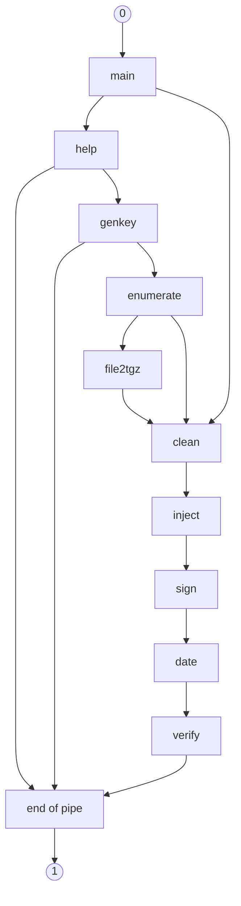
```mermaid
flowchart TB
stdin((0)) --> main
main --> help
help --> genkey
help --> end_of_pipe
genkey --> enumerate
genkey --> end_of_pipe
enumerate --> file2tgz
file2tgz --> clean
enumerate --> clean
main --> clean
clean --> inject
inject --> sign
sign --> date
date --> verify
verify --> end_of_pipe
end_of_pipe[end of pipe] --> stdout((1))
```
```bash
#######################################################
# MAIN                                                #
# <$* : help genkey { clean inject date sign verify } #
# <stdin  : input.raw                                 #
# >stdout : output.raw                                #
#######################################################
main() {
  if (( $# ));then
    local args="$*"
    args="${args//date/inject date}"
    args="${args//sign/inject sign}"
    help "$args" # suite du pipe
  else
    local filetype="$(lookup main)"
    if [[ $filetype =~ pdf ]];then
      read -r -p "$myname { clean inject date sign verify } ? " <&"$fdtty"
      [ -n "$REPLY" ] &&
        local args="$REPLY" &&
        args="${args//date/inject date}" &&
        args="${args//sign/inject sign}" &&
        clean "$args" < lookup.main
    else
      help help # affiche l'aide
    fi
    rm -f lookup.main
  fi | tee >(success "main output: $(lookup)" >&2) | cat
}

:<<'```bash'
```
## <a id=help>help</a>: Aide en ligne
Next: [genkey](#genkey) Previous: [main](#main)
```bash
##################
# Aide en ligne  #
# >stderr : help #
##################
help() {
  strip help "$@" > args
  local rargs=$? args="$(cat args)"
  if ((rargs == 0)) ; then
    # pas d'entrée ni de pipe suivant
    exec </dev/null
    end_of_pipe "$args" >/dev/null

    cat <<EOF >&2
$(echo -e "\033[1;36m")SealGood - $(_ "Document signing and timestamping via") OpenSSL + TSA$(echo -e "\033[0m")

$(_ "Usage"): $myname help genkey { clean inject date sign verify }

$(_ "COMMANDS"):
  genkey    $(_ "Generate a new password-protected ed25519 key pair")
  help      $(_ "Show this help")
  clean     $(_ "Extract original content without SEALGOOD tags")
  inject    $(_ "Inject SealGood payload into PDF, HTML or PEM file")
  date      $(_ "Timestamp a document via trusted third party (TSA)")
  sign      $(_ "Sign a document with your private key")
  verify    $(_ "Verify document signature and timestamp")

  $(_ "Commands compose into an implicitly ordered pipeline"):

  clean | inject | sign | date | verify
  - $(_ "reads data from") stdin
  - $(_ "comments progress on") stderr
  - $(_ "writes data to") stdout
  - $(_ "does NEVER write/modify any file directly")

  $(_ "Whenever input is a file list, the list is enumerated")
  $(_ "and each item is streamed to the processing pipeline").
  $(_ "The output is packaged in tar+gzip format with cryptographic")
  $(_ "hashes embedded in signed/timestamped filenames")
  enumerate
   \\
     +-- clean | inject | sign | date | verify

  inject          $(_ "respects existing SealGood payload");
  sign date       $(_ "implicitly perform") inject;
  sign date       $(_ "respect existing signature/timestamp");
  enumerate sign  $(_ "asks private key passphrase only once").

$(_ "Examples"):
  $(basename "$0") sign date < contract.pdf > contract_sealgood.pdf
  $(basename "$0") verify    < contract_sealgood.pdf
  ls contract*.pdf | $(basename "$0") sign date > contracts.tgz

$(_ "Files used"):
  \$HOME/.ssh/ed25519_private_*.pem  : $(_ "signer private keys")
  \$HOME/.ssh/ed25519_public_*.pem   : $(_ "associated public keys")
  \$HOME/.ssh/id_rsa.pub             : $(_ "signer identity declaration")
  https://freetsa.org/files/cacert.pem : $(_ "TSA root certificate")

$(_ "Free servlet") :
  ssh -o SendEnv=LANGUAGE sealgood@perso.tlp.name {clean inject date verify}

$(_ "See also") : https://github.com/tibolpol/sealgood

Copyright (c) 2025 Thibault Le Paul (@tibolpol)
Licence MIT - https://opensource.org/license/mit/
EOF
  else
    genkey "$args" # fonction suivante
  fi
}
:<<'```bash'
```
## <a id=genkey>genkey</a>: Génération des clés ed25519
Next: [enumerate](#enumerate) Previous: [help](#help)
```bash
####################################
# Génération des clés ed25519      #
# <stdin                           #
# <$* : fonctions à exécuter       #
# > $HOME/.ssh/ed25519_private.pem #
# > $HOME/.ssh/ed25519_public.pem  #
####################################
genkey() {
  strip genkey "$@" > args
  local rargs=$? args="$(cat args)"
  if ((rargs == 0));then
    get_profile

    # pas d'entrée ni de pipe suivant
    exec </dev/null
    end_of_pipe "$args" >/dev/null

    [ -s "$PRIVATE_KEY" ] && die 4 "$(_ "%s already exists and has non-zero size" "$PRIVATE_KEY")"

    read -p "$(_ "This key will be used to sign documents, please enter signer name"): " SIGNATAIRE

    PRIVATE_KEY="$HOME"/.ssh/ed25519_private_${SIGNATAIRE// /_}.pem
    PUBLIC_KEY="$HOME"/.ssh/ed25519_public_${SIGNATAIRE// /_}.pem

    [ -s $PRIVATE_KEY ] && die 4 "$(_ "%s already exists and has non-zero size" "$PRIVATE_KEY")"

    # 1. Générer la clé privée chiffrée avec AES-256
    # 2. Extraire la clé publique
    openssl genpkey -algorithm ed25519 -aes-256-cbc -out "$PRIVATE_KEY"
    openssl pkey -in "$PRIVATE_KEY" -pubout -out "$PUBLIC_KEY"

    fmt <<END
$(_ "You can (should) publish %s on a trusted public repository and mention its URL in %s" "$PUBLIC_KEY" "$HOME/.ssh/ed25519_public_${SIGNATAIRE// /_}.url")
$(_ "This way your document signatures will be non-repudiable and therefore accepted").
END
  else
    umask go=      # fichiers temporaires privés
    enumerate "$args" # suite du pipe s'occupe des data
  fi
}

:<<'```bash'
```
## <a id=enumerate>enumerate</a>: Multi-container
Next: [clean](#clean) ou [file2tgz](#file2tgz) Previous: [genkey](#genkey)
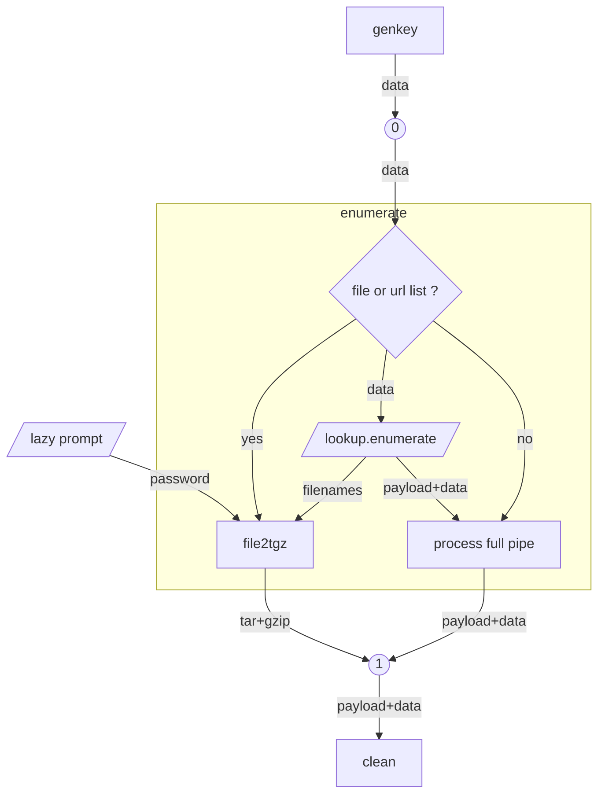
```mermaid
flowchart TB
genkey -->|data| l0
l0((0)) -->|data| lookup{file or url list ?}
TTY[/lazy prompt/] -->|password| file2tgz
subgraph enumerate
  lookup -->|data| lookup.enumerate[/lookup.enumerate/]
  lookup.enumerate -->|payload+data| process
  lookup -->|no| process[process full pipe]
  lookup -->|yes| file2tgz
  lookup.enumerate -->|filenames| file2tgz
end
  file2tgz -->|tar+gzip| l1
process -->|payload+data| l1((1))
l1 -->|payload+data| clean
```
```bash
##############################
# Multi-container            #
# <stdin                     #
# <$* : fonctions à exécuter #
# >stdout : output.raw       #
##############################
enumerate() {
  local args="$*"
  local filetype="$(lookup enumerate)"
  if [[ $filetype =~ file_or_url_list ]];then
    #####################
    # PASS just-in-time #
    #####################
    if strip sign "$args" >/dev/null;then
      coproc passrelay {
        read -r # attend le ask sur &"$fdpassask"
        cat >/dev/null & # puis vide
        if [ "$REPLY" = ask ] ; then
          read -r -s -p "$(_ "Private key password"): " PASS <&"$fdtty"
          echo >&2
          while :; do echo "$PASS"; done
        fi
      }
      exec {fdpassin}<&"${passrelay[0]}" {fdpassask}>&"${passrelay[1]}"
      # signale le coproc à verify
      export fdpassin fdpassask
    fi
    file2tgz
    rm -f tsr.bin signature.bin # pas de prompt exit_policy
  else
    clean "$args"
  fi < lookup.enumerate
}

:<<'```bash'
```
## <a id=file2tgz>file2tgz</a>: Sélection de fichiers à traiter en batch
Next: [clean](#clean) Previous: [enumerate](#enumerate)
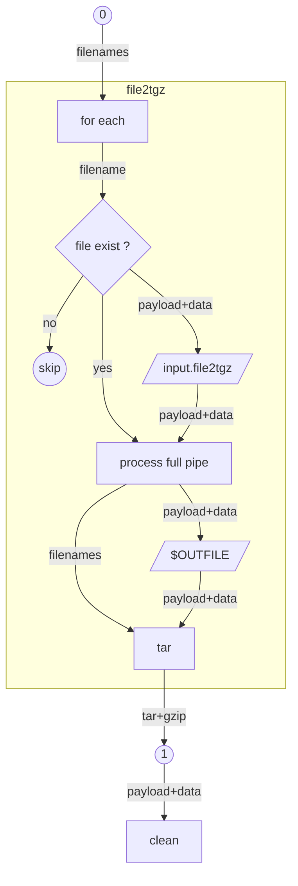
```mermaid
flowchart TB
l0((0)) -->|filenames| input[for each]
subgraph file2tgz
  input -->|filename| exist{file exist ?}
  exist -->|no| skip((skip))
  exist -->|payload+data| file[/input.file2tgz/]
  exist -->|yes| process[process full pipe]
  file -->|payload+data| process
  process -->|payload+data| out[/$OUTFILE/]
  process -->|filenames| tar
  out -->|payload+data| tar
end
tar -->|tar+gzip| l1((1))
l1 -->|payload+data| clean
```
```bash
############################################
# Sélection de fichiers à traiter en batch #
# <stdin : liste de fichiers               #
# >stdout : .tgz du résultat du pipeline   #
############################################
file2tgz(){
  tar --remove-files -zcf - -T <(
    export fdverifyout
    while read -r FILE; do
      ((FNR++))
      export FNR
      if (cd "$INITIAL_DIR" && cat < "$STOPFILE$FILE") > input.file2tgz 2>/dev/null ;then
        export OUTFILE="$(basename "$FILE")"
        # Exécution du pipe
        clean "$args" <input.file2tgz >"$OUTFILE"
        # Nommage en sortie, pattern _sealgood:<sha256sum:8>
        local filetype="$(lookup < input.file2tgz)"
        local newfiletype="$(lookup < "$OUTFILE")"
        if [[ $newfiletype =~ sealgood ]];then
          hash=$(clean clean < input.file2tgz | sha256sum | cut -c1-8)
          base="$(echo "${OUTFILE%.*}" | sed -E 's/_sealgood(:[a-zA-Z0-9]+)?$//')"
          if [[ "$base" == "$OUTFILE" ]]; then
            NEWFILE="${base}_sealgood:${hash}"
          else
            NEWFILE="${base}_sealgood:${hash}.${OUTFILE##*.}"
          fi
          mv "$OUTFILE" "$NEWFILE"
          OUTFILE="$NEWFILE"
          # Vérification de l'ancien nom
          if [[ "$FILE" =~ _sealgood:[a-zA-Z0-9]+(\..*)?$ ]] && [[ ! "$FILE" =~ _sealgood:$hash(\..*)?$ ]]; then
            alert="$(_ "Hash in old filename %s doesn't match document hash" "$(basename "$FILE")")"
            alert "$alert"
            alert "$FNR: $alert" 2>&"$fdverifyout"
          fi
        fi
        # décision d'ajouter le fichier en sortie
        if (
          [        -s "$OUTFILE"            ] &&  # le fichier n'est pas vide
            { [[ $filetype != $newfiletype ]] ||  # le status sealgood change
              [[ $newfiletype =~ sealgood  ]];})  # le nouveau status est ou reste sealgood
        then
          step "enumerate $FILE -> $OUTFILE"
          echo "$OUTFILE" # pris en charge par --remove-files
        else
          rm -f "$OUTFILE"
        fi
        unset consecutive_errors
      else
        alert "stdin:$FNR: $(_ "File is not readable: \"%s\"" ${FILE:0:50} )"
        (( ++consecutive_errors >= 5 )) && die 8 "$LINENO: $(_ "Too many consecutive errors: %d" $consecutive_errors)"
      fi
    done
  ) {fdverifyout}> >(
    # Résumé des messages de vérification à la fin
    cat > fdverifyout
    [ -s fdverifyout ] &&
      step "$(_ "Verification summary")"
      cat fdverifyout >&2
      step "$(_ "End of verifications")"
  ) | cat
}

:<<'```bash'
```
## <a id=clean>clean</a>: Restitue input.raw sans payload
Next: [inject](#inject) Previous: [main](#main), [enumerate](#enumerate), [file2tgz](#file2tgz)
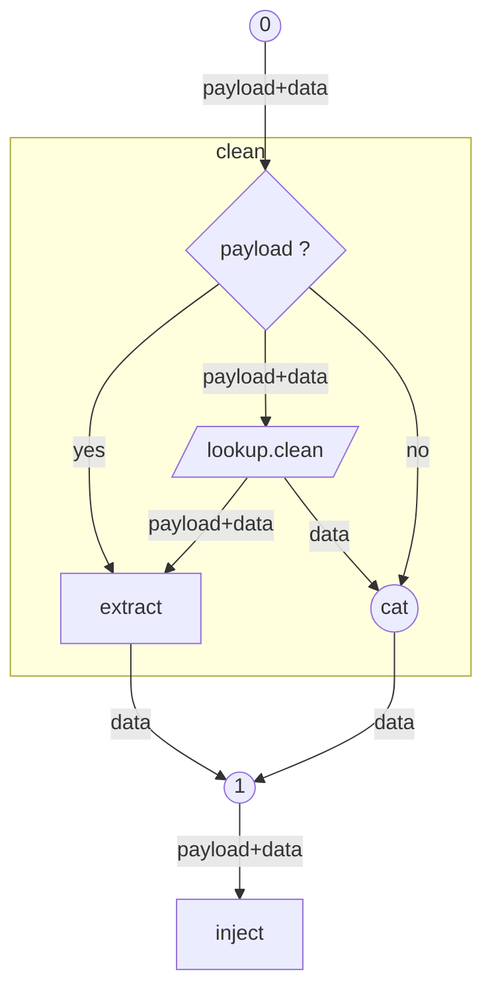
```mermaid
flowchart TB
l0((0)) -->|payload+data| lookup{payload ?}
subgraph clean
  lookup -->|payload+data| lookup.clean[/lookup.clean/]
  lookup.clean -->|data| cat
  lookup -->|no| cat((cat))
  lookup -->|yes| extract
  lookup.clean -->|payload+data| extract
end
extract -->|data| l1((1))
cat -->|data| l1((1))
l1 -->|payload+data| inject
```
```bash
######################################
# Restitue input.raw sans payload    #
# <stdin                             #
# <$* : fonctions à exécuter         #
# >stdout : original                 #
# <stdin après exécution : payload   #
######################################
clean() {
  strip clean "$@" > args
  local rargs=$? args="$(cat args)"
  if ((rargs == 0));then
    local filetype="$(lookup clean)"
    if [[ $filetype =~ sealgood ]];then
      if [[ $filetype =~ gzip ]];then
        local count=$(gzip -cd lookup.clean | awk '/### BEGIN SEALGOOD /{state=1}state && /^wc *: /{print $5;exit}')
        head -c "$count"
      else
        awk '/^(<!-- )?### BEGIN SEALGOOD /{state=1}!state{print}/^### END SEALGOOD /{state=0}'
      fi
    else
      cat
    fi <lookup.clean
    rm -f lookup.clean
  else
    cat
  fi | inject "$args"
}

:<<'```bash'
```
## <a id=inject>inject</a>: Injection d'informations cachées dans une copie du fichier
Next: [sign](#sign) Previous: [clean](#clean)
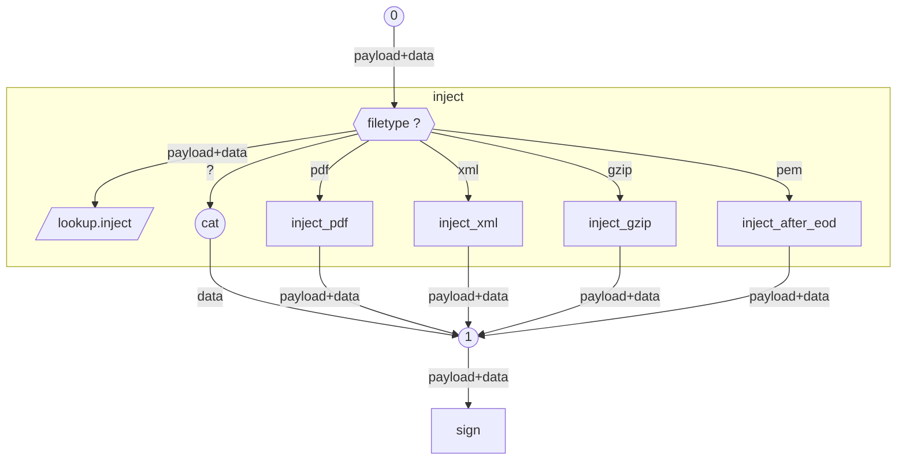
```mermaid
flowchart TB
l0((0)) -->|payload+data| lookup{{filetype ?}}
subgraph inject
  lookup -->|payload+data| lookup.inject[/lookup.inject/]
  lookup -->|pdf| inject_pdf
  lookup -->|xml| inject_xml
  lookup -->|gzip| inject_gzip
  lookup -->|pem| inject_after_eod
  lookup -->|?| cat((cat))
end
cat -->|data| l1((1))
inject_pdf -->|payload+data| l1((1))
inject_xml -->|payload+data| l1((1))
inject_gzip -->|payload+data| l1((1))
inject_after_eod -->|payload+data| l1((1))
l1 -->|payload+data| sign
```
```bash
##############################################################
# Injection d'informations cachées dans une copie du fichier #
# <stdin                                                     #
# <$*     : fonctions à exécuter                             #
# >stdout : copie avec payload & PLACEHOLDER                 #
##############################################################
inject() {
  strip inject "$@" > args
  local rargs=$? args="$(cat args)"
  if ((rargs == 0));then
    local filetype="$(lookup inject)"
    # Le type d'injection dépend de filetype
    if [[ $filetype =~ pdf ]];then
      inject_pdf       "$filetype"
    elif [[ $filetype =~ xml  ]];then
      inject_xml      "$filetype"
    elif [[ $filetype =~ html ]];then
      inject_xml      "$filetype"
    elif [[ $filetype =~ gzip ]];then
      inject_gzip     "$filetype"
    elif [[ $filetype =~ PEM..$(_ "Public key") ]];then
      inject_after_eod "$filetype"
    else
      warning "$(_ "I don't know how to inject into") mimetype: $filetype"
      cat
    fi <lookup.inject | tee >(echo "inject output: $(lookup)" >&2)
    rm -f lookup.inject
  else
    cat
  fi | sign "$args"
}

:<<'```bash'
```
## <a id=date>date</a>: Horodatage d'un document (payload, hash, signature)
Next: [verify](#verify) Previous: [sign](#sign)
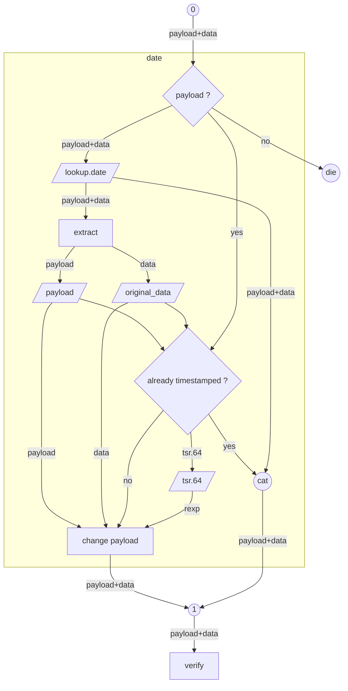
```mermaid
flowchart TB
l0((0)) -->|payload+data| lookup{payload ?}
subgraph date
  lookup -->|payload+data| lookup.date[/lookup.date/]
  lookup.date -->|payload+data| extract
  extract -->|payload| payload[/payload/]
  extract -->|data| data[/original_data/]
  new_tsr_64{already timestamped ?}
  payload --> new_tsr_64
  data --> new_tsr_64
  lookup -->|yes| new_tsr_64
  new_tsr_64 -->|yes| cat((cat))
  new_tsr_64 -->|tsr.64| tsr.64[/tsr.64/]
  payload -->|payload| edit
  data -->|data| edit
  new_tsr_64 -->|no| edit[change payload]
  tsr.64 -->|rexp| edit
end
lookup.date -->|payload+data| cat
edit -->|payload+data| l1
cat -->|payload+data| l1((1))
lookup -->|no| die((die))
l1 -->|payload+data| verify
```
```bash
#######################################################
# Horodatage d'un document (payload, hash, signature) #
# <stdin                                              #
# <$* : fonctions à exécuter                          #
# >stdout : copie horodatée avec payload              #
#######################################################
date() {
  strip date "$@" > args
  local rargs=$? args="$(cat args)"
  if ((rargs == 0));then
    local filetype="$(lookup date)"
    if [[ $filetype =~ sealgood ]];then
      if [[ $filetype =~ gzip ]];then
        # wc : x x x payload field 5
        local count=$(<lookup.date gzip -cd | awk '/### BEGIN SEALGOOD /{state=1} state && /^wc *: /{print $5;exit}')
        head -c "$count" | tee >((echo ++$LINENO++;cat)>/dev/fd/$fddebug) >original_data
        gzip -cd | tee >((echo ++$LINENO++;cat)>/dev/fd/$fddebug) >payload
      else
        >payload 28>original_data \
        awk '/^(<!-- )?### BEGIN SEALGOOD /{ state=1 } { if (state) print; else print >"/dev/fd/28"}/^### END SEALGOOD /{state=0}'
      fi
      if new_tsr_64 >tsr.64;then
        local REXP="^PLACEHOLDER_UNTIMESTAMPED_FILE"
        grep -aq "$REXP" <payload || REXP="$(cat  tsr.tmp.64)"
        grep -aq "$REXP" <payload || die 8 "$LINENO: assert failure"
        # edit du résultat
        if [[ $filetype =~ gzip ]];then
          cat original_data
          <payload sed "s|$REXP|$(cat tsr.64)|" | gzip -nc
        else
          <lookup.date sed "s|$REXP|$(cat tsr.64)|" # À revoir : lit tout le doc
        fi
      else
        cat lookup.date
        warning "$(_ "Already timestamped")"
      fi </dev/null  # protege stdin
    else
      die 8 "$LINENO: assert failure"
    fi <lookup.date | tee >(echo "date output: $(lookup)" >&2)
    rm -f lookup.date
  else
    cat
  fi | verify "$args"
}

:<<'```bash'
```
## <a id=sign>sign</a>: Signature d'un document (payload, hash, signature)
Next: [date](#date) Previous: [inject](#inject)
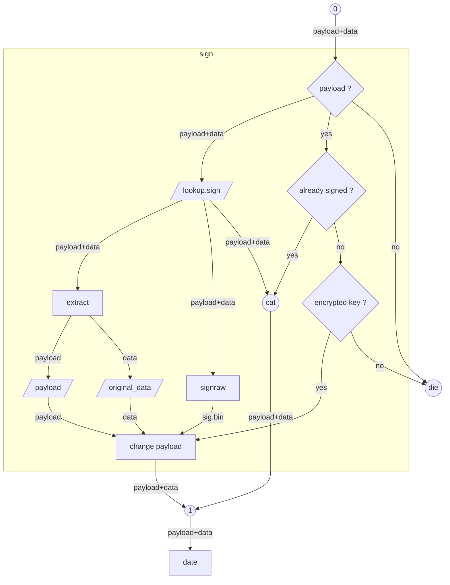
```mermaid
flowchart TB
l0((0)) -->|payload+data| lookup{payload ?}
subgraph sign
  lookup -->|payload+data| lookup.sign[/lookup.sign/]
  lookup.sign -->|payload+data| extract
  extract -->|payload| payload[/payload/]
  extract -->|data| data[/original_data/]
  lookup -->|yes| t2{already signed ?}
  t2 -->|yes| cat((cat))
  t2 -->|no| t3{encrypted key ?}
  t3 -->|yes| sed
  lookup.sign -->|payload+data| signraw
  signraw -->|sig.bin| sed[change payload]
  payload -->|payload| sed
  data -->|data| sed
end
lookup.sign -->|payload+data| cat
sed -->|payload+data| l1
cat -->|payload+data| l1((1))
t3 -->|no| die((die))
lookup -->|no| die
l1 -->|payload+data| date
```
```bash
######################################################
# Signature d'un document (payload, hash, signature) #
# stdin   : data à signer                            #
# <$*     : fonctions à exécuter                     #
# <$PRIVATE_KEY : nom local de la clé privée         #
# >stdout : copie signée avec payload                #
######################################################
sign() {
  strip sign "$@" > args
  local rargs=$? args="$(cat args)"
  if ((rargs == 0));then
    local filetype="$(lookup sign)"
    if [[ $filetype =~ sealgood ]];then
      if [[ $filetype =~ gzip ]];then
        if zgrep -aq "^PLACEHOLDER_UNSIGNED_FILE" lookup.sign; then
          grep -q 'empty password' <( openssl pkey -in "$PRIVATE_KEY" -noout -passin pass: </dev/null 2>&1) | cat || die 4 "$(_ "%s is not encrypted" "$PRIVATE_KEY")"
          local count=$(gzip -cd lookup.sign | awk '/### BEGIN SEALGOOD /{state=1}state && /^wc *: /{print $5;exit}')
          head -c "$count"
          gzip -cd | sed "s|^PLACEHOLDER_UNSIGNED_FILE|$(<lookup.sign signraw | base64 -w 0)|" | gzip -nc
        else
          cat
          warning "$(_ "Already signed")"
        fi
      else
        if grep -aq "^PLACEHOLDER_UNSIGNED_FILE" lookup.sign; then
          grep -q 'empty password' <( openssl pkey -in "$PRIVATE_KEY" -noout -passin pass: </dev/null 2>&1) | cat || die 4 "$(_ "%s is not encrypted" "$PRIVATE_KEY")"
          sed "s|^PLACEHOLDER_UNSIGNED_FILE|$(<lookup.sign signraw | base64 -w 0)|"
        else
          cat
          warning "$(_ "Already signed")"
        fi
      fi <lookup.sign
    else
      die 8 "$LINENO: assert failure"
    fi | tee >(echo "sign output: $(lookup)" >&2)
    rm -f lookup.sign
  else
    cat
  fi | date "$args"
}

:<<'```bash'
```
## <a id=verify>verify</a>: Vérification de sealgood signature & timestamp
Next: [end_of_pipe](#end_of_pipe) Previous: [date](#date)
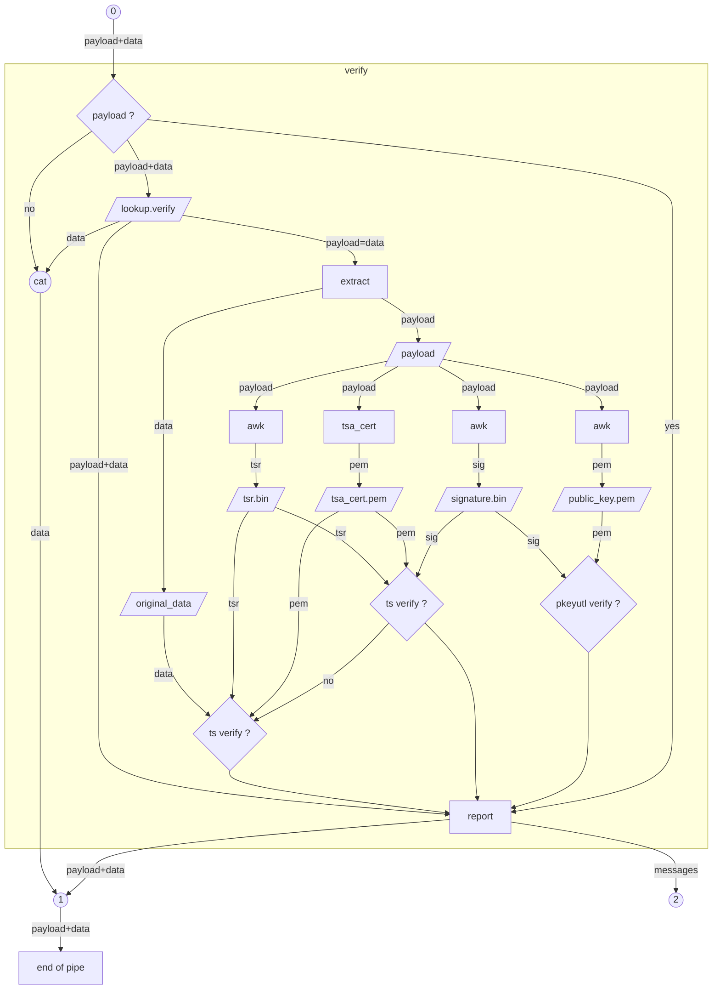
```mermaid
flowchart TB
l0((0)) -->|payload+data| lookup{payload ?}
subgraph verify
  lookup -->|payload+data| lookup.verify[/lookup.verify/]
  lookup.verify -->|data| cat0((cat))
  lookup -->|no| cat0
  lookup -->|yes| report
  lookup.verify -->|payload=data| extract
  extract -->|payload| payload[/payload/]
  extract -->|data| data[/original_data/]
  payload -->|payload| awk-2[awk]
  awk-2 -->|sig| sig[/signature.bin/]
  payload -->|payload| awk-3[awk]
  awk-3 -->|pem| pubkey[/public_key.pem/]
  payload -->|payload| awk-4[awk]
  awk-4 -->|tsr| tsr[/tsr.bin/]
  payload -->|payload| tsa_cert
  tsa_cert -->|pem| tsa_cert.pem[/tsa_cert.pem/]
  pubkey -->|pem| verif-1{pkeyutl verify ?}
  sig -->|sig| verif-1
  sig -->|sig| verif-2
  tsa_cert.pem -->|pem| verif-2{ts verify ?}
  tsr -->|tsr| verif-2
  verif-2 -->|no| verif-3{ts verify ?}
  tsa_cert.pem -->|pem| verif-3
  tsr -->|tsr| verif-3
  data -->|data| verif-3
  verif-1 --> report
  verif-2 --> report
  verif-3 --> report
  lookup.verify -->|payload+data| report
end
report -->|payload+data| l1((1))
report -->|messages| l2((2))
cat0 -->|data| l1((1))
l1 -->|payload+data| end_of_pipe[end of pipe]
```
```bash
##################################################
# Vérification de sealgood signature & timestamp #
# <stdin  : data avec payload                    #
# <$*     : fonctions à exécuter                 #
# >stderr : statut de la vérification            #
# >stdout : copie de data                        #
##################################################
verify() {
  strip verify "$@" > args
  local rargs=$? args="$(cat args)"
  if ((rargs == 0));then
    local filetype="$(lookup verify)"
    rm -f tsr.bin signature.bin
    if [[ $filetype =~ sealgood ]];then
      # Extraction des éléments du document
      step "$(_ "Extracting verification elements")"

      # 1. Extraction du contenu original
      if [[ $filetype =~ gzip ]]; then
        local count=$(gzip -cd lookup.verify | awk '/### BEGIN SEALGOOD /{state=1}state && /^wc *: /{print $5;exit}')
        head -c "$count"
        zcat >payload
      else
        tee >(awk '/^(<!-- )?### BEGIN SEALGOOD /{state=1}state{print}/^### END SEALGOOD /{state=0}' >payload) | clean clean
      fi <lookup.verify >original_data
      success "$(_ "Original content extracted")"

      # 2. Extraction de la signature
      <payload awk '/\/sig\.64$/,/\/sig\.bin$/' | grep -vE '/sig\.64$|/sig\.bin$|^PLACEHOLDER' | tr -d ' \n' | base64 -d >signature.bin
      if ! [ -s signature.bin ]; then
        warning "$(_ "Signature not found in document")"
      else
        success "$(_ "Signature extracted and decoded")"
        # 3. Extraction de la clé publique
        <payload awk '/-----BEGIN PUBLIC KEY-----/,/-----END PUBLIC KEY-----/' payload | head -n 3 >public_key.pem
        if ! [ -s public_key.pem ]; then
          warning "$(_ "Public key not found in document")"
        else
          success "$(_ "Public key extracted")"
        fi
      fi

      # 4. Extraction du TSR
      <payload awk '/\/tsr\.64$/,/\/tsr\.bin$/' | grep -vE '/tsr\.64$|/tsr\.bin$|^PLACEHOLDER' | tr -d ' \n' | base64 -d >tsr.bin
      if ! [ -s tsr.bin ]; then
        warning "$(_ "TSR not found in document")"
      else
        success "$(_ "TSR extracted and decoded")"

        # 5. Extraction du certificat TSA
        tsa_cert <payload
        [ -s tsa_cert.pem ] && success "$(_ "TSA certificate extracted")"
      fi

      if [ -s tsa_cert.pem ] || [ -s public_key.pem ]; then

        # Vérification de la signature
        if [ -s public_key.pem ] && [ -s signature.bin ] && [ -s original_data ]; then
          step "$(_ "Verifying digital signature")"
          (
            set -x
            openssl pkeyutl -verify -pubin -inkey public_key.pem -sigfile signature.bin -in original_data -rawin &> sig_result ||
            openssl pkeyutl -verify -pubin -inkey public_key.pem -sigfile signature.bin -in <(openssl dgst -sha256 -binary original_data) &> sig_result | cat
          )
          SIG_VERIFY=$?

          if (( SIG_VERIFY  == 0 )); then
            success "$(_ "Signature successfully verified")"
            SIGNATURE_VALID=true
          else
            alert "$(_ "Signature verification failed")"
            cat sig_result >&2
            SIGNATURE_VALID=false
          fi
        fi

        # Vérification de l'horodatage
        if [ -s tsr.bin ] && [ -s tsa_cert.pem ] && [ -s original_data ] ; then
          step "$(_ "Verifying TSA timestamp")"
          (( DATE_VERIFY = 1 ))
          if [ -s signature.bin ];then
            (
            set -x
            openssl ts -verify -in tsr.bin -CAfile tsa_cert.pem -data signature.bin &> ts_result
            )
            DATE_VERIFY=$?
          fi
          if (( DATE_VERIFY != 0 ));then
            (
              set -x
              openssl ts -verify -in tsr.bin -CAfile tsa_cert.pem -data original_data &> ts_result
            )
            DATE_VERIFY=$?
          fi
          if (( DATE_VERIFY == 0 )); then
            success "$(_ "Timestamp successfully verified")"
            TIMESTAMP_VALID=true
          else
            alert "$(_ "Timestamp verification failed")"
            cat ts_result >&2
            TIMESTAMP_VALID=false
          fi

          # Affichage des détails de l'horodatage
          echo -e "\n$(_ "Timestamp details"):" >&2
          openssl ts -reply -in tsr.bin -text | grep -A2 "Time stamp:" >&2
        fi
      fi

      # Résumé final
      step "$(_ "Verification summary")"

      echo -e "$(_ "Signature status"): $([ "$SIGNATURE_VALID" = true ] && success "$(_ "VALID")" 2>&1 || { [ "$SIGNATURE_VALID" = false ] && alert "$(_ "INVALID")" || warning "$(_ "MISSING")" 2>&1 ; } 2>&1)" >&2
      echo -e "$(_ "Timestamp status"): $([ "$TIMESTAMP_VALID" = true ] && success "$(_ "VALID")" 2>&1 || { [ "$TIMESTAMP_VALID" = false ] && alert "$(_ "INVALID")" || warning "$(_ "MISSING")" 2>&1 ; } 2>&1)" >&2

      # signé, horodaté et intact
      # signé et intact
      # horodaté et intact
      # ni signé ni horodaté
      # altéré
      if   [ "$SIGNATURE_VALID" = true ] && [ "$TIMESTAMP_VALID" = true ]; then
        success "$(_ "Document") $(_ "is signed, timestamped and intact")"
        ((fdverifyout)) && success "$FNR: $OUTFILE $(_ "is signed, timestamped and intact")" 2>&$fdverifyout
      elif [ "$SIGNATURE_VALID" = true ] && [ "$TIMESTAMP_VALID" = "" ]; then
        success "$(_ "Document") $(_ "is signed and intact")"
        ((fdverifyout)) && success "$FNR: $OUTFILE $(_ "is signed and intact")" 2>&$fdverifyout
      elif [ "$SIGNATURE_VALID" = ""   ] && [ "$TIMESTAMP_VALID" = true ]; then
        success "$(_ "Document") $(_ "is timestamped and intact")"
        ((fdverifyout)) && success "$FNR: $OUTFILE $(_ "is timestamped and intact")" 2>&$fdverifyout
      elif [ "$SIGNATURE_VALID" = ""   ] && [ "$TIMESTAMP_VALID" = "" ]; then
        warning "$(_ "Document") $(_ "is neither signed nor timestamped")"
        ((fdverifyout)) && success "$FNR: $OUTFILE $(_ "is neither signed nor timestamped")" 2>&$fdverifyout
      else
        alert "$(_ "Document") $(_ "has been altered")"
        ((fdverifyout)) && alert "$FNR: $OUTFILE $(_ "has been altered")" 2>&$fdverifyout
      fi
      cat lookup.verify
    else
      cat lookup.verify
    fi | tee >(echo "verify output: $(lookup)" >&2) | cat
  else
    cat
  fi | end_of_pipe "$args"
}

:<<'```bash'
```
## <a id=end_of_pipe>end_of_pipe</a>: Arguments restants en bout de pipe
```bash
######################################
# Arguments restants en bout de pipe #
######################################
end_of_pipe(){
  (( $# && $(eval echo -n "$*" | wc -c) )) &&
    warning "$(_ "Remaining arguments \"%s\" could not be processed" "$*")"
  cat
}

:<<'```bash'
```
## <a id=strip>strip</a>: Consommation de la chaîne d'arguments
```bash
#########################################
# Consommation de la chaîne d'arguments #
# <$1   : mot                           #
# <$*:2 : autres                        #
# >stdout : autres sans mot             #
# >$?   : présence mot                  #
#########################################
strip() {
  local word="$1"
  local input="${*:2}"  # Get all arguments after the first one
  if [[ "$input" =~ (^|[[:space:]])"$word"($|[[:space:]]) ]]; then
    echo -n "${input//$word/}"
    return 0
  else
    echo -n "$input"
    return 1
  fi
}

:<<'```bash'
```
## <a id=pass>pass</a>: Contourne une fonction
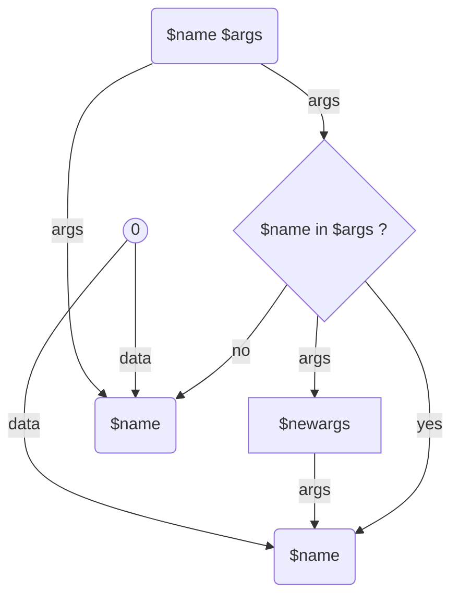
```mermaid
flowchart TB
args($name $args) -->|args| t0{$name in $args ?}
t0 -->|args| $newargs
t0 -->|no| $name-no($name) 
t0 -->|yes| $name-yes($name)
l0((0)) -->|data| $name-no
args -->|args| $name-no
$newargs -->|args| $name-yes
l0 -->|data| $name-yes
```
```bash
# Exécute $1 ou $2
# <$1 : name
# <$3 : args
# <stdin
# >stdout
pass() {
  if [ -s name-yes ]
  then
    process
  else
    cat
  fi | next "$(strip name $args)"

  >args strip $name "$@"
  local rargs=$?
  local args="$(cat args)"
  if ((rargs == 0));then
    $process
  else
    cat
  fi | $next "$args"
}
:<<'```bash'
```
## <a id=get_payload>get_payload</a>: PAYLOAD : Incorpore les explications et les signatures
```bash
#######################################################################
# PAYLOAD : Incorpore les explications et les signatures              #
# C'est juste du plaintext qui commence et termine par des balises    #
# <stdin : original data                                              #
# <$REPOS_KEY : nom web de la clé publique                            #
# <$PUBLIC_KEY : nom local de la clé publique                         #
# <$HOME/.ssh/id_rsa.pub : emplacement du nom du signataire           #
# <https://freetsa.org/files/cacert.pem : cartificat racine de la TSA #
# >stdout : payload                                                   #
#######################################################################
get_payload() {
[ -s original_data ] || cat > original_data
get_profile
cat <<EOD
### BEGIN SEALGOOD SIGNATURE ###
SealGood - $(_ "The 100%% DIY Document Authenticator")
Copyright (c) 2025 Thibault Le Paul (@tibolpol)
Licence MIT - https://opensource.org/license/mit/
https://github.com/tibolpol/sealgood/

$(_ "WARNING!  As with a physical document, verifying authenticity and signature is
harder than signing.  The key is to guarantee that the means exist, that they
are freely and publicly available, and that they use recognized, documented
and standard tools at each step for transparency of proof.  Each step can
therefore be done manually with this guide.  A lightweight integration is
proposed on the site"):  https://github.com/tibolpol/sealgood

$(_ "Verification tools"):
- $(_ "POSIX standard"): awk, base64, file, wc
- $(_ "non-POSIX but recognized standard"): openssl

$(_ "Free servlet"):
ssh -o SendEnv=LANGUAGE sealgood@perso.tlp.name {clean inject date verify} < "\$filename.pdf" > /tmp/result

$(_ "The signed document has the following properties"):
file -bi : $(<original_data lookup)
wc       : $(<original_data wc -)

$(_ "Signer declaration"): $(cut -d' ' -f3- < $HOME/.ssh/id_rsa.pub)
$(_ "Signer ed25519 public key"): $REPOS_KEY

$(_ "WARNING!  The readable signer declaration here could have been forged.  What
makes it valid is the trusted third party associated with this key (website,
personal exchange, blockchain, public key sealed and published on an
irrefutable address by the signer)").

$(_ "The signature and timestamp remain valid as long as the content outside the
BEGIN SEALGOOD and END SEALGOOD tags is not altered").

$(_ "If verification element 4 is not a PLACEHOLDER but a base64 signature code,
the signer's identity can be proven").

## $(_ "Verification element") 1:  $(_ "Key presentation URL, presented by the
# signer as trusted, so that they cannot repudiate this signature").
# $REPOS_KEY

## $(_ "Verification element") 2:  $(_ "Signer's ed25519 public key")
# $(_ "COPY the three lines below and PASTE into file /tmp/%s") "$(basename "$PUBLIC_KEY")"
# $(_ "or download %s to /tmp/%s") "$REPOS_KEY" "$(basename "$PUBLIC_KEY")"
-----BEGIN PUBLIC KEY-----
$(awk '/^-----BEGIN PUBLIC KEY/{getline;print;exit}' "$PUBLIC_KEY")
-----END PUBLIC KEY-----

## $(_ "Verification element") 3:  $(_ "Unsigned file without payload") ($(_ "just before signing"))
awk '/^### BEGIN SEALGOOD /{state=1}!state{print}/^### END SEALGOOD /{state=0}' < "\$filename.pdf" > /tmp/\$filename.pdf # $(_ "Unsigned file without payload")

## $(_ "Verification element") 4:  $(_ "Signature of the original file hash")
# $(_ "COPY the line below and PASTE into file") /tmp/sig.64
PLACEHOLDER_UNSIGNED_FILE
base64 -d < /tmp/sig.64 > /tmp/sig.bin

## $(_ "Final verification"):  $(_ "Current file hash and validation of match using public key")
# $(_ "Links the file hash to the private key owner's trust chain")
openssl dgst -sha256 -binary /tmp/file.pdf >/tmp/hash.bin
openssl pkeyutl -verify -pubin -inkey /tmp/\$(basename "\$PUBLIC_KEY") -sigfile /tmp/sig.bin -in /tmp/hash.bin # $(_ "verify signature")

### BEGIN SEALGOOD TIMESTAMP ###

$(_ "If verification element 2 is not a PLACEHOLDER but a base64 code, the signing
date can be proven").

## $(_ "Verification element") 1:  $(_ "TSA authority root certificate")
# $(_ "COPY the three lines below and PASTE into file") /tmp/freetsa_cacert.pem
# $(_ "or download %s to %s" https://freetsa.org/files/cacert.pem /tmp/freetsa_cacert.pem)
$(
  [ -s freetsa_cacert.pem ] ||
  curl -s https://freetsa.org/files/cacert.pem |
  awk '$1~"^-----"{if(buf){print buf;buf=""};print;next}{buf=buf $0}END{printf("%s",buf)}' >tsa_cert.pem
  cat tsa_cert.pem
)
openssl x509 -reply -text -in /tmp/freetsa_cacert.pem # $(_ "show certificate details")

## $(_ "Verification element") 2:  $(_ "Base64 encoding of TSA-validated tsr")
# $(_ "COPY the line below and PASTE into file") /tmp/tsr.64
PLACEHOLDER_UNTIMESTAMPED_FILE
base64 -d < /tmp/tsr.64 > /tmp/tsr.bin
openssl ts -reply -text -in /tmp/tsr.bin # $(_ "show timestamp details")

## $(_ "Verification element") 3:  $(_ "Untimestamped file without payload") ($(_ "just before timestamping"))
awk '/^### BEGIN SEALGOOD /{state=1}!state{print}/^### END SEALGOOD /{state=0}' < "\$filename.pdf" > /tmp/\$filename.pdf # $(_ "Unsigned file without payload")

## $(_ "Final verification"):  $(_ "Either current file or your signature hash, and validation of match
# using tsr and certificate chain")
# $(_ "Links your signature or file hash to the tsr date in the TSA trust chain")
openssl ts -verify -in /tmp/tsr.bin -CAfile /tmp/freetsa_cacert.pem -data /tmp/sig.bin # $(_ "verify timestamp")
openssl ts -verify -in /tmp/tsr.bin -CAfile /tmp/freetsa_cacert.pem -data /tmp/\$filename.pdf # $(_ "verify timestamp")

### END SEALGOOD ###
EOD
}

:<<'```bash'
```
## <a id=new_tsr_64>new_tsr_64</a>: Décision d'horodatage
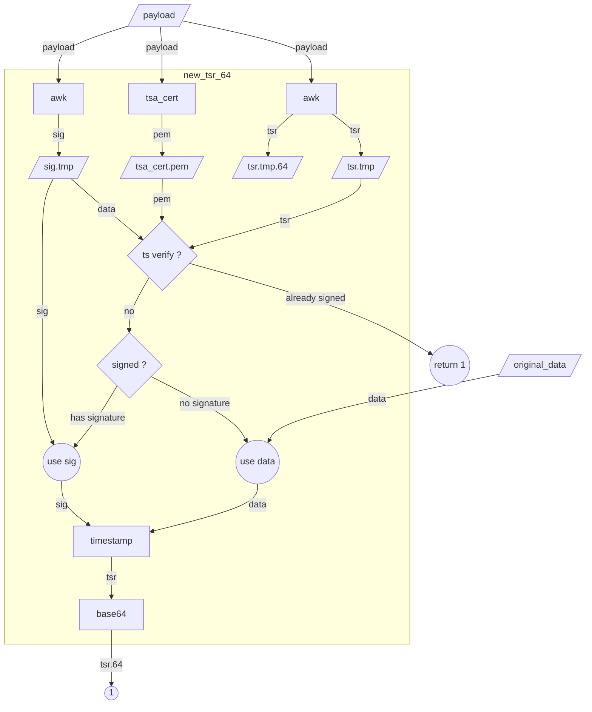
```mermaid
flowchart TB
payload[/payload/] -->|payload| awk-sig[awk]
payload -->|payload| awk-tsr[awk]
payload -->|payload| tsa_cert
od[/original_data/] -->|data| c2
subgraph new_tsr_64
  awk-sig -->|sig| sig[/sig.tmp/]
  awk-tsr -->|tsr| tsr[/tsr.tmp/]
  awk-tsr -->|tsr| tsr64[/tsr.tmp.64/]
  tsa_cert -->|pem| pem[/tsa_cert.pem/]
  tsr -->|tsr| ts{ts verify ?}
  pem -->|pem| ts
  sig -->|data| ts
  ts -->|no| t2{"signed ?"}
  t2 -->|has signature| c1((use sig))
  sig -->|sig| c1
  t2 -->|no signature| c2((use data))
  c2 -->|data| timestamp
  c1 -->|sig| timestamp
  timestamp -->|tsr| base64
end
ts -->|already signed| c0((return 1))
base64 -->|tsr.64| l1((1))
```
```bash
####################################
# Décision d'horodatage            #
# <payload                         #
# <original_data                   #
# >stdout : nouveau tsr.64 ou vide #
# >sig.tmp : signature existante   #
# >tsr.tmp : tsr existant          #
# >tsr.tmp.64 : tsr existant b64   #
# >tsa_cert : certificat TSA       #
# >$?     : 1 si déjà horodaté     #
####################################
new_tsr_64(){
  # parse payload existing sign + existing tsr
  <payload awk '/\/sig\.64$/,/\/sig\.bin$/' | grep -vE '/sig\.64$|/sig\.bin$|^PLACEHOLDER' | tr -d ' \n'                  | base64 -d >sig.tmp
  <payload awk '/\/tsr\.64$/,/\/tsr\.bin$/' | grep -vE '/tsr\.64$|/tsr\.bin$|^PLACEHOLDER' | tr -d ' \n' | tee tsr.tmp.64 | base64 -d >tsr.tmp
  if ! <payload grep -aq "^PLACEHOLDER_UNTIMESTAMPED_FILE"; then
    <payload tsa_cert
    if openssl ts -verify -in tsr.tmp -CAfile tsa_cert.pem -data sig.tmp &> ts_result; then
      return 1 # Déjà horodaté
    fi
  fi
  if [ -s sig.tmp ]; then
    cat sig.tmp # Horodatage sur la signature (préférable ? obligatoire ?)
  else
    cat original_data # Horodatage sur le document clean (ancienne méthode)
  fi | timestamp | base64 -w 0 | tr -d ' \n' 
}

:<<'```bash'
```
## <a id=tsa_cert>tsa_cert</a>: Extraction du certificat TSA
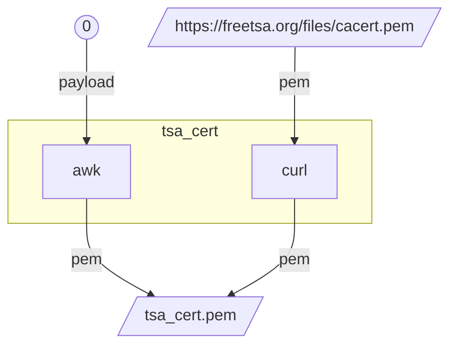
```mermaid
flowchart TB
l0((0)) -->|payload| awk
net[/https://freetsa.org/files/cacert.pem/] -->|pem| curl
subgraph tsa_cert
  awk
  curl
end
awk -->|pem| tsacert[/tsa_cert.pem/]
curl -->|pem| tsacert
```
```bash
################################
# Extraction du certificat TSA #
# <stdin : payload             #
# >tsa_cert.pem                #
################################
tsa_cert() {
  if ! [ -s tsa_cert.pem ];then
    awk '/-----BEGIN CERTIFICATE-----/,/-----END CERTIFICATE-----/' >tsa_cert.pem
    if ! [ -s tsa_cert.pem ]; then
      warning "$(_ "TSA certificate not found - Downloading from") freetsa.org"
      curl -s https://freetsa.org/files/cacert.pem >tsa_cert.pem ||
      warning "$(_ "Failed to download TSA certificate")"
    fi
  fi
}

:<<'```bash'
```
## <a id=timestamp>timestamp</a>: Calcule un timestamp
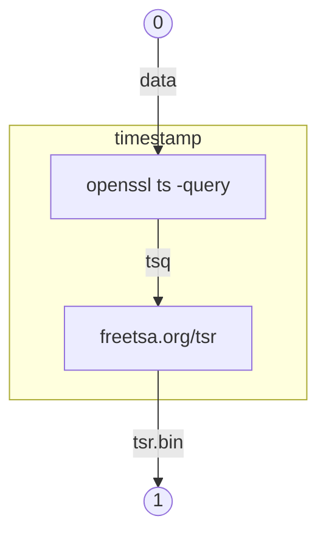
```mermaid
flowchart TB
l0((0)) -->|data| ts[openssl ts -query]
subgraph timestamp
  ts -->|tsq| curl[freetsa.org/tsr]
end
curl -->|tsr.bin| l1((1))
```
```bash
########################
# Calcule un timestamp #
# <stdin  : data       #
# >stdout : tsr.bin    #
########################
timestamp() {
  openssl ts -query -data /dev/stdin -sha256 -cert |
  curl -s -H "Content-Type: application/timestamp-query" --data-binary @- --output - https://freetsa.org/tsr
}

:<<'```bash'
```
## <a id=signraw>signraw</a>: Calcule une signature
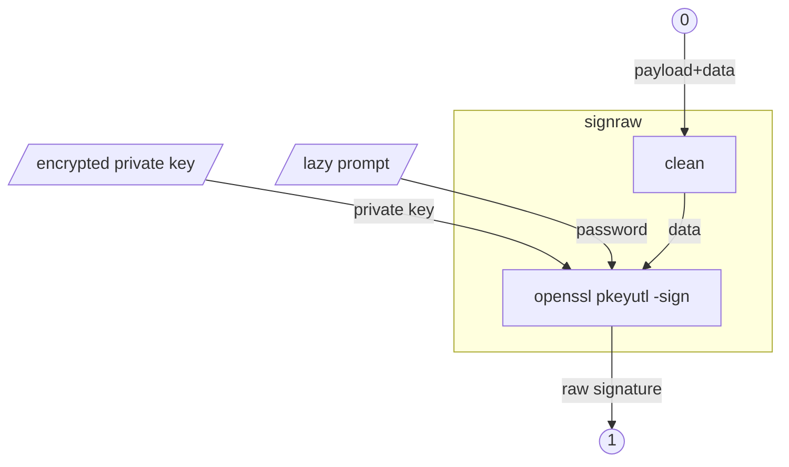
```mermaid
flowchart TB
l0((0)) -->|payload+data| clean
pkey[/encrypted private key/] -->|private key| pkeyutl
TTY[/lazy prompt/] -->|password| pkeyutl
subgraph signraw
  clean -->|data| pkeyutl
end
pkeyutl[openssl pkeyutl -sign] -->|raw signature| l1((1))
```
```bash
###########################
# Calcule une signature   #
# <stdin                  #
# >stdout : signature.bin #
###########################
signraw() {
  clean clean >original_data
  if ((fdpassin)); then
    echo ask >&"$fdpassask"
    openssl pkeyutl -sign -inkey "$PRIVATE_KEY" -rawin -in original_data -passin stdin <&"$fdpassin"
  else
    openssl pkeyutl -sign -inkey "$PRIVATE_KEY" -rawin -in original_data
  fi
}

:<<'```bash'
```
## <a id=signdgst>signdgst</a>: Calcule une signature
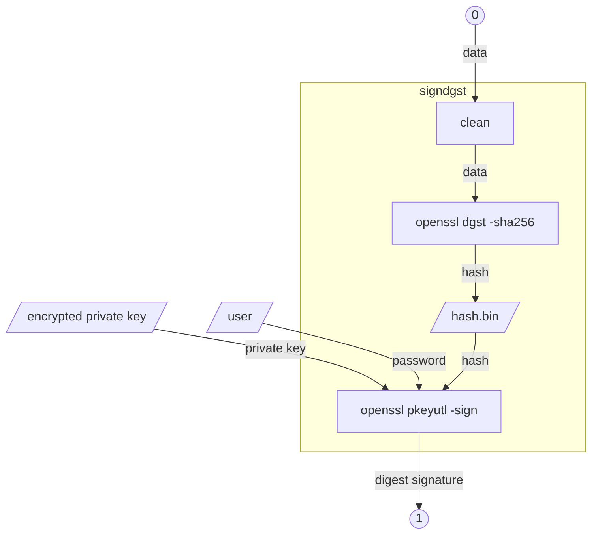
```mermaid
flowchart TB
l0((0)) -->|data| clean
pkey[/encrypted private key/] -->|private key| pkeyutl
TTY[/user/] -->|password| pkeyutl
subgraph signdgst
  clean -->|data| dgst[openssl dgst -sha256]
  dgst -->|hash| hash[/hash.bin/]
  hash -->|hash| pkeyutl
end
pkeyutl[openssl pkeyutl -sign] -->|digest signature| l1((1))
```
```bash
###########################
# Calcule une signature   #
# <stdin                  #
# >stdout : signature.bin #
###########################
signdgst(){
  # Cette signature n'est pas compatible avec le schéma de clé
  clean clean | openssl dgst -sha256 -binary >hash.bin
  if ((fdpassin)); then
    echo ask >&"$fdpassask"
    openssl pkeyutl -sign -inkey "$PRIVATE_KEY" -in hash.bin -passin stdin <&"$fdpassin"
  else
    openssl pkeyutl -sign -inkey "$PRIVATE_KEY" -in hash.bin
  fi
}

:<<'```bash'
```
## <a id=inject_after_eod>inject_after_eod</a>: Injection d'informations cachées dans une copie du fichier
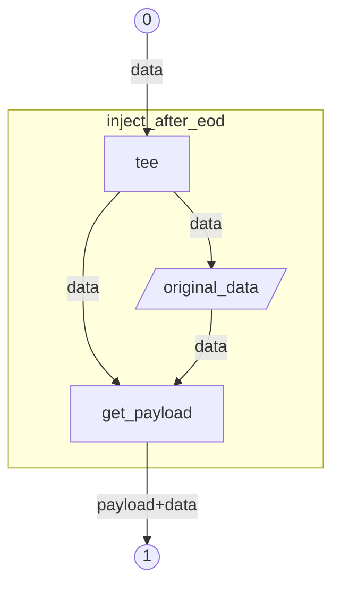
```mermaid
flowchart TB
l0((0)) -->|data| tee
subgraph inject_after_eod
  tee -->|data| od[/original_data/]
  tee -->|data| get_payload
  od  -->|data| get_payload
end
get_payload -->|payload+data| l1((1))
```
```bash
##############################################################
# Injection d'informations cachées dans une copie du fichier #
# <$1 : filetype                                             #
# <stdin                                                     #
# >stdout : copie avec payload & PLACEHOLDER                 #
##############################################################
inject_after_eod() {
  tee original_data
  [[ $1 =~ sealgood ]] || get_payload < original_data
}

:<<'```bash'
```
## <a id=inject_pdf>inject_pdf</a>: Injection d'informations cachées dans une copie du fichier pdf
```bash
############################################################################################################################
# Injection d'informations cachées dans une copie du fichier pdf                                                           #
# https://stackoverflow.com/questions/11896858/does-the-eof-in-a-pdf-have-to-appear-within-the-last-1024-bytes-of-the-file #
# Un peu limite mais pas rencontré de cas rhédibitoire et clean rend le pdf récupérable anyway                             #
# <$1 : filetype                                                                                                           #
# <stdin                                                                                                                   #
# >stdout : copie avec payload & PLACEHOLDER                                                                               #
############################################################################################################################
inject_pdf() {
  inject_after_eod "$@"
}

:<<'```bash'
```
## <a id=inject_xml>inject_xml</a>: Injection d'informations cachées dans une copie du HTML | XML
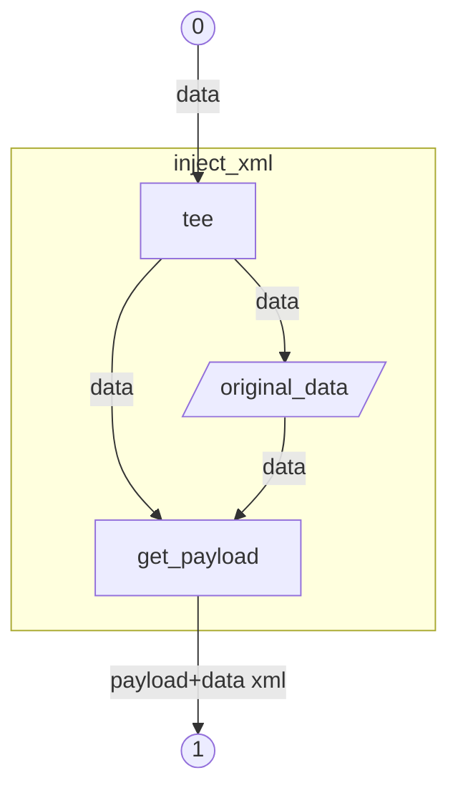
```mermaid
flowchart TB
l0((0)) -->|data| tee
subgraph inject_xml
  tee -->|data| od[/original_data/]
  tee -->|data| get_payload
  od  -->|data| get_payload
end
get_payload -->|payload+data xml| l1((1))
```
```bash
##################################################################
# Injection d'informations cachées dans une copie du HTML | XML  #
# <$1 : filetype                                                 #
# <stdin                                                         #
# >stdout : copie avec payload & PLACEHOLDER                     #
##################################################################
inject_xml() {
  tee original_data
  [[ $1 =~ sealgood ]] || echo "<!-- $(get_payload < original_data) -->"
}

:<<'```bash'
```
## <a id=inject_gzip>inject_gzip</a>: Injection d'informations cachées dans une copie du gzip
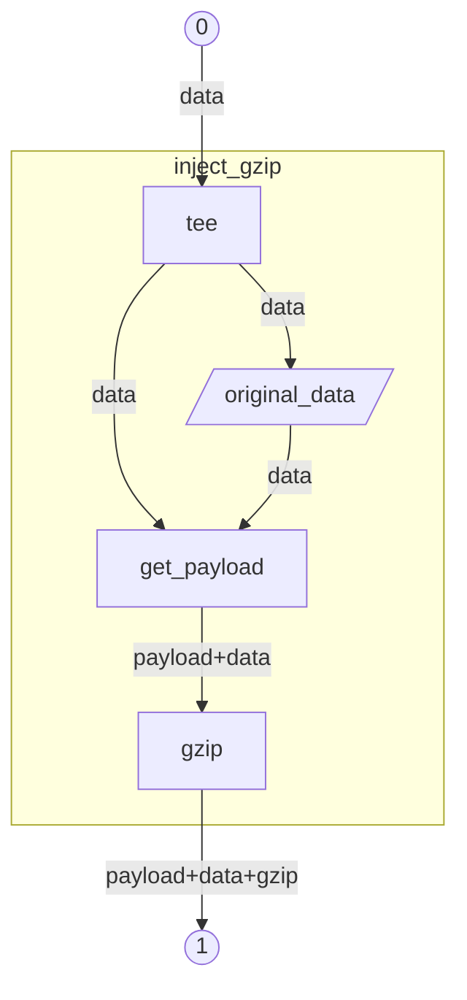
```mermaid
flowchart TB
l0((0)) -->|data| tee
subgraph inject_gzip
  tee -->|data| od[/original_data/]
  tee -->|data| get_payload
  od  -->|data| get_payload
  get_payload -->|payload+data| gzip
end
gzip -->|payload+data+gzip| l1((1))
```
```bash
##################################################################
# Injection d'informations cachées dans une copie du gzip        #
# https://www.gnu.org/software/gzip/manual/gzip#Advanced-usage   #
# <$1 : filetype                                                 #
# <stdin                                                         #
# >stdout : copie avec payload & PLACEHOLDER                     #
##################################################################
inject_gzip() {
  tee original_data
  [[ $1 =~ sealgood ]] || get_payload < original_data | gzip -c
}

:<<'```bash'
```
## <a id=exit_policy>exit_policy</a>: Sortie de script
```bash
###############################################################
# Sortie de script                                            #
# Prompt pour conserver le répertoire temporaire après verify #
# Désactivé par enumerate en supprimant les fichiers          #
###############################################################
exit_policy(){
  [ -s tsr.bin ] || [ -s signature.bin ] &&
  <&"$fdtty" read -r -p $'\n\033[1;36m'"=== $(_ "Keep temporary directory for inspection") [yN] ? "$'\033[0m' &&
  [[ $REPLY == y ]] &&
  warning "$PWD $(_ "is kept")" &&
  ls -l >&2 ||
  rm -rf "$TMPDIR"
}

:<<'```bash'
```
## <a id=lookup>lookup</a>: Scan l'input pour valider les actions
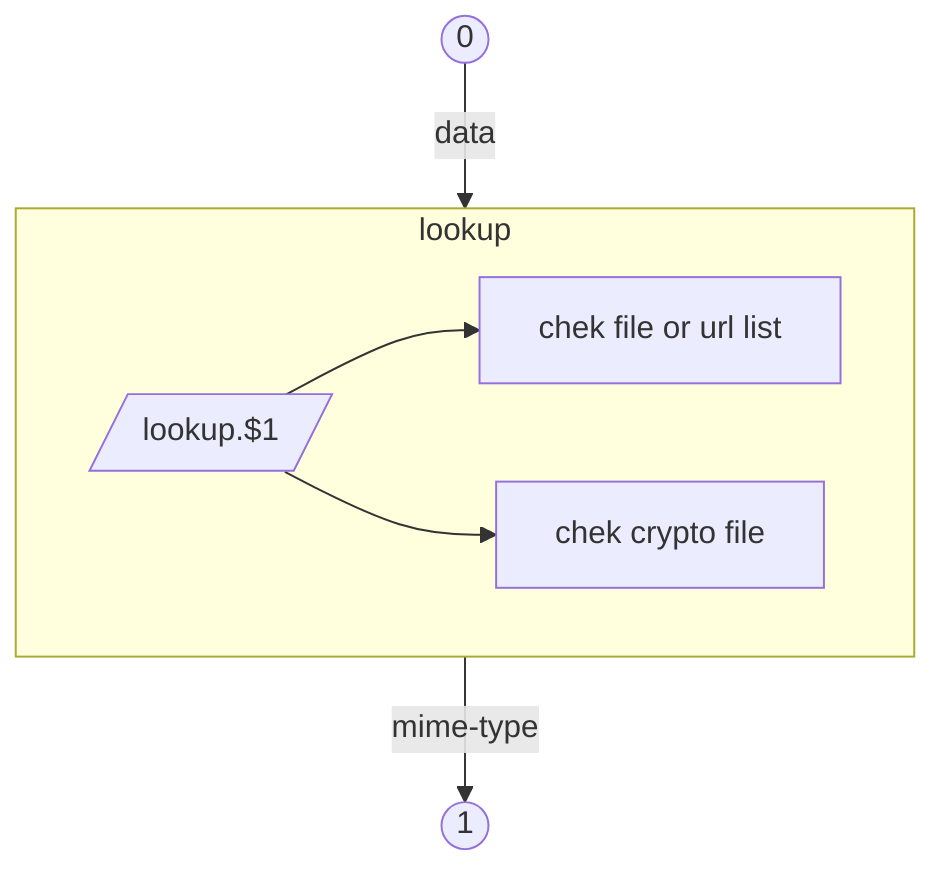
```mermaid
flowchart TB
l0((0)) -->|data| lookup
subgraph lookup
  x0[/lookup.$1/] --> cfl[chek file or url list]
  x0 --> ccy[chek crypto file]
end
lookup -->|mime-type| l1((1))
```
```bash
###########################################
# Scan l'input pour valider les actions   #
# <$1 : pour nommage de copie de l'entrée #
# <stdin                                  #
# >stdout : type de fichier               #
# >lookup.$1  : copie stdin               #
###########################################
lookup() {
  sfx="${1:-$RANDOM}"
  cat >lookup."$sfx"
  local result="$(file -b -i lookup."$sfx")"
  if [[ $result =~ application/octet-stream ]];then
    if grep -aq '^%PDF-' lookup."$sfx" && grep -aq '^%%EOF' lookup."$sfx" ; then
      result="${result/octet-stream/pdf+octet-stream}"
    else
      result="${result/octet-stream/$(check_crypto_file "$sfx" "$result")+octet-stream}"
    fi
  fi
  if [[ $result =~ application/gzip ]];then
    zcat lookup."$sfx" > lookup."$sfx".unzip
    if grep -aq '### BEGIN SEALGOOD' lookup."$sfx".unzip;then
      ## ATTENTION gzip puis sealgood != sealgood puis gzip à ignorer ici
      # count < dernier wc : x x x
      local count=$(< lookup."$sfx".unzip awk '
      /### BEGIN SEALGOOD /{state=1}
      /### END SEALGOOD /{state=0}
      state && /^wc *: /{count=$5}
      END{if(count) print count}'
      )
      # exactement gunzip après count
      # exactement 1ère et dernière ligne
      < <(<lookup."$sfx" tail -c+$((1+count)) | gunzip -cd 2>/dev/null) awk '
      /^### BEGIN SEALGOOD .*###$/ {begin=FNR}
      /^### END SEALGOOD ###$/{end=FNR}
      END{exit !(begin==1 && end==FNR)}' &&
      result="${result/gzip/sealgood+gzip}"
    fi
    content_filetype="$(lookup < lookup."$sfx".unzip)"
    # echo "#debug $content_filetype" >&2
    if [[ $content_filetype =~ application/(x-)tar ]];then
      result="${result/gzip/tar+gzip}"
    fi
  elif [[ $result =~ text/xml ]];then
    if grep -aq '^<!-- ### BEGIN SEALGOOD' lookup."$sfx";then
      result="${result/xml/sealgood+xml}"
    fi
  elif [[ $result =~ text/html ]];then
    if grep -aq '^<!-- ### BEGIN SEALGOOD' lookup."$sfx";then
      result="${result/html/sealgood+html}"
    fi
  elif [[ $result =~ application/pdf ]];then
    if grep -aq '^### BEGIN SEALGOOD' lookup."$sfx";then
      result="${result/pdf/sealgood+pdf}"
    elif pdftotext lookup."$sfx" - 2>/dev/null | grep -aq '^### BEGIN SEALGOOD';then
      result="${result/pdf/sealgood-old+pdf}"
    fi
  elif [[ $result =~ text/plain ]];then
    if grep -aq '^-----BEGIN' lookup."$sfx";then
      result="${result/plain/$(check_crypto_file "$sfx" "$result")+plain}"
    elif LC_ALL=C grep -aEq '^([^[:space:]]|https?://[^/]).{1,256}[^[:space:]]$' lookup."$sfx";then
      result="${result/plain/$(check_file_or_url_list "$sfx" "$result")+plain}"
    fi
  fi
  if [[ ! $result =~ sealgood ]];then
    if grep -aEq '^(<!-- )?### BEGIN SEALGOOD' lookup."$sfx";then
      result="${result/\//\/sealgood+}"
    fi
  fi
  echo "${result/\/+/\/}"
  [ "$sfx" = "$1" ] || rm -f lookup."$sfx"{,.unzip}
}

:<<'```bash'
```
## <a id=file_or_url_list>file_or_url_list</a>: Lookup file_or_url_list
```bash
###########################################
# Lookup file_or_url_list                 #
# <$1 : pour nommage de copie de l'entrée #
# <$2 : known filetype                    #
# <lookup.$1                              #
# >stdout : type de fichier               #
###########################################
check_file_or_url_list() {
  if [[ $2 =~ text/plain ]] ; then
    echo $(
      cd "$INITIAL_DIR"
      while read -r; do # traitement des noms de fichier ou URL
        is_file_or_url "$REPLY" || return
      done
      echo file_or_url_list
    )
  fi < lookup."$1"
}

:<<'```bash'
```
## <a id=is_file_or_url>is_file_or_url</a>: 1 si url ou si fichier existe
```bash
#######################################
# <$1 : file_or_url                   #
# >$? : 1 si url ou si fichier existe #
#######################################
is_file_or_url() {
  [[ $1 =~ ^https?:// ]] || [ -s "$STOPFILE$1" ]
}

:<<'```bash'
```
## <a id=check_crypto_file>check_crypto_file</a>: Lookup des types de fichier crypto
```bash
###########################################
# Lookup des types de fichier crypto      #
# <$1 : pour nommage de copie de l'entrée #
# <$2 : known filetype                    #
# <lookup.$1                              #
# >stdout : type de fichier               #
###########################################
check_crypto_file() {
  local result=""
  if [[ $2 =~ octet-stream ]] ; then
    if (openssl pkcs12 -password pass: -in lookup."$1" -info -noout;(($?==1 || $?==0))) &>/dev/null ; then
      result="[PKCS#12] $(_ "Key+certificate container")"
    elif (openssl x509 -password pass: -in lookup."$1" -noout;(($?==1 || $?==0))) &>/dev/null; then
      #local algo=$(openssl x509 -password pass: -in lookup."$1" -noout -text | grep "Public Key Algorithm")
      result="[X.509] $(_ "Certificate")"
    elif (openssl pkey -password pass: -in lookup."$1" -noout;(($?==1 || $?==0))) &>/dev/null; then
      #local algo=$(openssl pkey -in "$file" -noout -text | grep "algorithm")
      result="[PKEY] $(_ "Private key")"
    elif (openssl req -password pass: -in lookup."$1" -noout;(($?==1 || $?==0))) &>/dev/null; then
      result="[CSR] $(_ "Certificate signing request")"
    fi
  elif [[ $2 =~ text/plain ]] ; then
    if grep -q "BEGIN CERTIFICATE REQUEST" lookup."$1"; then
      result="[CSR] $(_ "Certificate signing request")"
    elif grep -q "BEGIN OPENSSH PRIVATE KEY" lookup."$1"; then
      result="[OPENSSH] $(_ "Private key")"
    elif grep -q "BEGIN PRIVATE KEY" lookup."$1"; then
      result="[PEM] $(_ "UNENCRYPTED private key")"
    elif grep -q "BEGIN ENCRYPTED PRIVATE KEY" lookup."$1"; then
      result="[PEM] $(_ "ENCRYPTED private key")"
    elif grep -q "BEGIN PUBLIC KEY" lookup."$1"; then
      result="[PEM] $(_ "Public key")"
    elif grep -q "BEGIN RSA PUBLIC KEY" lookup."$1"; then
      result="[RSA] $(_ "Public key")"
    elif grep -q "BEGIN RSA PRIVATE KEY" lookup."$1"; then
      result="[RSA] $(_ "Private key")"
    elif gdalinfo lookup."$1" &>/dev/null; then
      result="$(_ "DEM file (GDAL format)")"
    elif grep -q "BEGIN CERTIFICATE" lookup."$1"; then
      result="[PEM] $(_ "Certificate")"
    fi
  fi
  echo "$result"
}

:<<'```bash'
```
## <a id=die>die</a> <a id=alert>alert</a> <a id=step>step</a> <a id=success>success</a> <a id=warning>warning</a>: Envoi de messages
```bash
#####################
# Envoi de messages #
#####################
die() {
  rc="$1"
  shift
  alert "$(basename "$0") rc=$rc $*"
  exit "$rc"
}
alert() {
  echo -e "\033[1;31m$(_ "ERROR"): $*\033[0m" >&2
}
step() {
  echo -e "\n\033[1;36m=== $* ===\033[0m" >&2
}
success() {
  echo -e "\033[1;32m$*\033[0m" >&2
}
warning() {
  echo -e "\033[1;33m$*\033[0m" >&2
}

:<<'```bash'
```
## <a id=get_profile>get_profile</a>: Dépendances user
```bash
get_profile() {
  list=("$HOME"/.ssh/ed25519_private*.pem)
  export PRIVATE_KEY="${list[0]}" # nom local de la clé privée
  list=("$HOME"/.ssh/ed25519_public*.pem)
  export PUBLIC_KEY="${list[0]}" # nom local de la clé publique
  export REPOS_KEY="$(cat < "$HOME"/.ssh/ed25519_public*.url)" # nom web de la clé publique
}

:<<'```bash'
```
## <a id=_>_</a>: I18n
```bash
_(){
  key="$1"
  shift
  printf "$(gettext "$key")" "$@"
}

:<<'```bash'
```
## <a id=run>run</a>: RUN
```bash
################################
# Vérification des dépendances #
################################
for cmd in awk openssl base64 curl; do
  command -v $cmd &> /dev/null ||
  die 16 "$LINENO: $(_ "Missing command"): $cmd"
done </dev/null

export myname="$(basename "$0")"
export TEXTDOMAIN="$myname"
export mydir="$(dirname "$(realpath "$0")")"
export TEXTDOMAINDIR="${mydir/bin/locale}"
export TMPDIR="$(mktemp -d)"
trap exit_policy EXIT
cd "$TMPDIR" || die 16 "$LINENO: FATAL"
INITIAL_DIR="$OLDPWD"
STOPFILE="${STOPFILE:-}" # simple et efficace pour la servlet
shopt -s nullglob

(( fdtty )) || exec {fdtty}</dev/tty
export fdtty

main "$@" | cat
