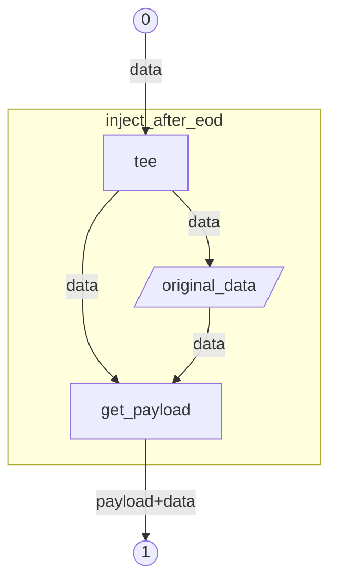
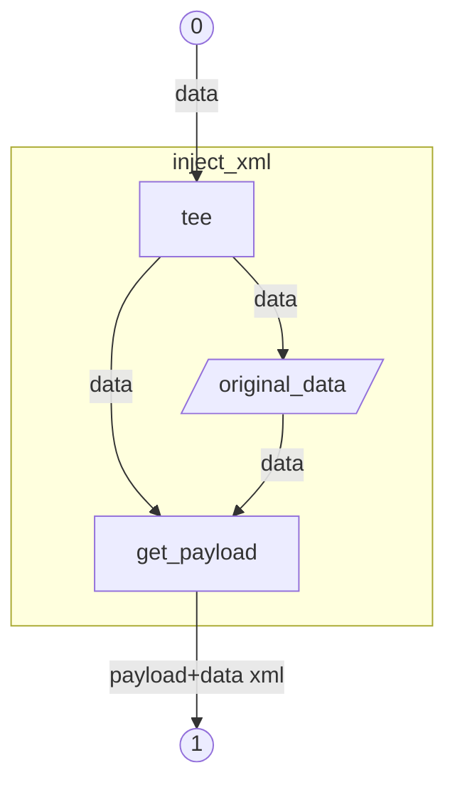
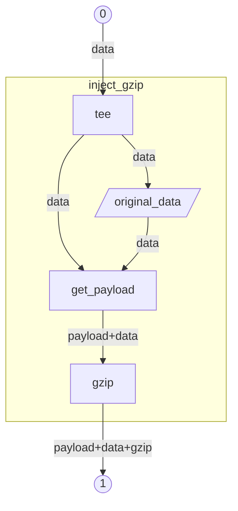

:<<'```bash'
[view this file as Markdow](https://github.com/tibolpol/sealgood/blob/develop/docs/fr/filetypes.md)
```bash
##########################################################
# Copyright (c) 2025 Thibault Le Paul (@tibolpol)        #
# Licence MIT - https://opensource.org/license/mit/      #
##########################################################
# Extensions par filetype
#############################
# <$1: suffixe              #
# <$2: resultat de file -bi #
# >lookup.$1                #
# >lookup.$1.original       #
# >lookup.$1.payload        #
# >lookup.$1.unzip          #
# >?: 0 si $2 match         #
# >stdout: precise filetype #
#############################
extract_gzip(){
  local sfx="$1" result="$2"
  if [[ $result =~ application/gzip ]];then
    (zcat lookup."$sfx" || die $LINENO assert) > lookup."$sfx".unzip
    if grep -aq '### BEGIN SEALGOOD' lookup."$sfx".unzip;then
      # count < dernier wc : x x x
      local count=$(< lookup."$sfx".unzip awk '
        /### BEGIN SEALGOOD /{state=1}
        /### END SEALGOOD /{state=0}
        state && /^wc *: /{count=$5}
        END{if(count) print count}'
      )
      { head -c $count >lookup."$sfx".original 2>/dev/null &&
        zcat >lookup."$sfx".payload 2>/dev/null &&
        zcat lookup."$sfx".original >lookup."$sfx".unzip ||
        rm -f lookup."$sfx".{original,payload}
      } <lookup."$sfx"
    fi
  return 0;else return 1;fi
}
extract_xml(){
  local sfx="$1" result="$2"
  if [[ $result =~ text/xml ]];then
    <lookup."$sfx" >lookup."$sfx".payload 28>lookup."$sfx".original \
    awk '/^<!-- ### BEGIN SEALGOOD /{ state=1 } { if (state) print; else print >"/dev/fd/28"}/^### END SEALGOOD ###/{state=0}'
  return 0;else return 1;fi
}
extract_html(){
  local sfx="$1" result="$2"
  if [[ $result =~ text/html ]];then
    <lookup."$sfx" >lookup."$sfx".payload 28>lookup."$sfx".original \
    awk '/^<!-- ### BEGIN SEALGOOD /{ state=1 } { if (state) print; else print >"/dev/fd/28"}/^### END SEALGOOD ###/{state=0}'
  return 0;else return 1;fi
}
extract_pdf(){
  local sfx="$1" result="$2"
  if [[ $result =~ application/pdf ]];then
    <lookup."$sfx" >lookup."$sfx".payload 28>lookup."$sfx".original \
    awk '/^### BEGIN SEALGOOD /{ state=1 } { if (state) print; else print >"/dev/fd/28"}/^### END SEALGOOD ###/{state=0}'
  return 0;else return 1;fi
}
extract_plain(){
  local sfx="$1" result="$2"
  if [[ $result =~ text/plain ]];then
    if grep -aq '^-----BEGIN' lookup."$sfx";then
      <lookup."$sfx" >lookup."$sfx".payload 28>lookup."$sfx".original \
      awk '/^### BEGIN SEALGOOD /{ state=1 } { if (state) print; else print >"/dev/fd/28"}/^### END SEALGOOD ###/{state=0}'
      echo "${result/plain/$(check_crypto_file "$sfx" "$result")+plain}"
    elif LC_ALL=C grep -aEq '^([^[:space:]]|https?://[^/]).{1,256}[^[:space:]]$' lookup."$sfx";then
      echo "${result/plain/$(check_file_or_url_list "$sfx" "$result")+plain}"
    fi
  return 0;else return 1;fi
}

:<<'```bash'
```
## <a id=inject_after_eod>inject_after_eod</a>: Injection d'informations cachées dans une copie du fichier

```bash
##############################################################
# Injection d'informations cachées dans une copie du fichier #
# <$1 : filetype                                             #
# <stdin                                                     #
# >stdout : copie avec payload & PLACEHOLDER                 #
##############################################################
inject_after_eod() {
  tee original_data
  [[ $1 =~ sealgood ]] || get_payload < original_data
}

:<<'```bash'
```
## <a id=inject_pdf>inject_pdf</a>: Injection d'informations cachées dans une copie du fichier pdf
```bash
############################################################################################################################
# Injection d'informations cachées dans une copie du fichier pdf                                                           #
# https://stackoverflow.com/questions/11896858/does-the-eof-in-a-pdf-have-to-appear-within-the-last-1024-bytes-of-the-file #
# Un peu limite mais pas rencontré de cas rhédibitoire et clean rend le pdf récupérable anyway                             #
# <$1 : filetype                                                                                                           #
# <stdin                                                                                                                   #
# >stdout : copie avec payload & PLACEHOLDER                                                                               #
############################################################################################################################
inject_pdf() {
  inject_after_eod "$@"
}

:<<'```bash'
```
## <a id=inject_xml>inject_xml</a>: Injection d'informations cachées dans une copie du HTML | XML

```bash
##################################################################
# Injection d'informations cachées dans une copie du HTML | XML  #
# <$1 : filetype                                                 #
# <stdin                                                         #
# >stdout : copie avec payload & PLACEHOLDER                     #
##################################################################
inject_xml() {
  tee original_data
  [[ $1 =~ sealgood ]] || echo "<!-- $(get_payload < original_data) -->"
}

:<<'```bash'
```
## <a id=inject_gzip>inject_gzip</a>: Injection d'informations cachées dans une copie du gzip

```bash
##################################################################
# Injection d'informations cachées dans une copie du gzip        #
# https://www.gnu.org/software/gzip/manual/gzip#Advanced-usage   #
# <$1 : filetype                                                 #
# <stdin                                                         #
# >stdout : copie avec payload & PLACEHOLDER                     #
##################################################################
inject_gzip() {
  tee original_data
  [[ $1 =~ sealgood ]] || get_payload < original_data | gzip -c
}

:<<'```bash'
```
## <a id=file_or_url_list>file_or_url_list</a>: Lookup file_or_url_list
```bash
###########################################
# Lookup file_or_url_list                 #
# <$1 : pour nommage de copie de l'entrée #
# <$2 : known filetype                    #
# <lookup.$1                              #
# >stdout : type de fichier               #
###########################################
check_file_or_url_list() {
  if [[ $2 =~ text/plain ]] ; then
    echo $(
      cd "$INITIAL_DIR"
      while read -r; do # traitement des noms de fichier ou URL
        is_file_or_url "$REPLY" || return
      done
      echo file_or_url_list
    )
  fi < lookup."$1"
}

:<<'```bash'
```
## <a id=is_file_or_url>is_file_or_url</a>: 1 si url ou si fichier existe
```bash
#######################################
# <$1 : file_or_url                   #
# >$? : 1 si url ou si fichier existe #
#######################################
is_file_or_url() {
  [[ $1 =~ ^https?:// ]] || [ -s "$STOPFILE$1" ]
}

:<<'```bash'
```
## <a id=check_crypto_file>check_crypto_file</a>: Lookup des types de fichier crypto
```bash
###########################################
# Lookup des types de fichier crypto      #
# <$1 : pour nommage de copie de l'entrée #
# <$2 : known filetype                    #
# <lookup.$1                              #
# >stdout : type de fichier               #
###########################################
check_crypto_file() {
  local result=""
  if [[ $2 =~ octet-stream ]] ; then
    if (openssl pkcs12 -password pass: -in lookup."$1" -info -noout;(($?==1 || $?==0))) &>/dev/null ; then
      result="[PKCS#12] $(_ "Key+certificate container")"
    elif (openssl x509 -password pass: -in lookup."$1" -noout;(($?==1 || $?==0))) &>/dev/null; then
      #local algo=$(openssl x509 -password pass: -in lookup."$1" -noout -text | grep "Public Key Algorithm")
      result="[X.509] $(_ "Certificate")"
    elif (openssl pkey -password pass: -in lookup."$1" -noout;(($?==1 || $?==0))) &>/dev/null; then
      #local algo=$(openssl pkey -in "$file" -noout -text | grep "algorithm")
      result="[PKEY] $(_ "Private key")"
    elif (openssl req -password pass: -in lookup."$1" -noout;(($?==1 || $?==0))) &>/dev/null; then
      result="[CSR] $(_ "Certificate signing request")"
    fi
  elif [[ $2 =~ text/plain ]] ; then
    if grep -q "BEGIN CERTIFICATE REQUEST" lookup."$1"; then
      result="[CSR] $(_ "Certificate signing request")"
    elif grep -q "BEGIN OPENSSH PRIVATE KEY" lookup."$1"; then
      result="[OPENSSH] $(_ "Private key")"
    elif grep -q "BEGIN PRIVATE KEY" lookup."$1"; then
      result="[PEM] $(_ "UNENCRYPTED private key")"
    elif grep -q "BEGIN ENCRYPTED PRIVATE KEY" lookup."$1"; then
      result="[PEM] $(_ "ENCRYPTED private key")"
    elif grep -q "BEGIN PUBLIC KEY" lookup."$1"; then
      result="[PEM] $(_ "Public key")"
    elif grep -q "BEGIN RSA PUBLIC KEY" lookup."$1"; then
      result="[RSA] $(_ "Public key")"
    elif grep -q "BEGIN RSA PRIVATE KEY" lookup."$1"; then
      result="[RSA] $(_ "Private key")"
    elif gdalinfo lookup."$1" &>/dev/null; then
      result="$(_ "DEM file (GDAL format)")"
    elif grep -q "BEGIN CERTIFICATE" lookup."$1"; then
      result="[PEM] $(_ "Certificate")"
    fi
  fi
  echo "$result"
}
