:<<'```bash'
[view this file as Markdow](https://github.com/tibolpol/sealgood/blob/develop/docs/fr/sealgood.md)
```bash
##########################################################
# Copyright (c) 2025 Thibault Le Paul (@tibolpol)        #
# Licence MIT - https://opensource.org/license/mit/      #
#                                                        #
# <$*    : help genkey { clean date sign verify } #
# <stdin : data to sign | timestamp                      #
# <$HOME/.ssh/ed25519_*.pem : Ed25519 keys               #
# <$HOME/.ssh/id_rsa.pub : identity clear text           #
# >stdout : signed | timestamped data                    #
# >stderr : errors                                       #
##########################################################
:<<'```bash'
```
[[_TOC_]]

## <a id=main>MAIN</a>

Principes de design :
- Un seul répertoire temporaire commun
- Options minimalistes, piloté par les data
- Peut s'exécuter en servlet ssh
- Ne touche aucun fichier hors du répertoire temporaire
- Composition en Unix pipe -> parallélisation, isolation, data driven
- Chaque fonction commence par un fork décidant si elle doit s'exécuter ou être passante
- $args est [consommé](#strip) au fil du pipe, [end of pipe](#end_of_pipe) vérifie que tous ont été consommés

Le pipe complet est :

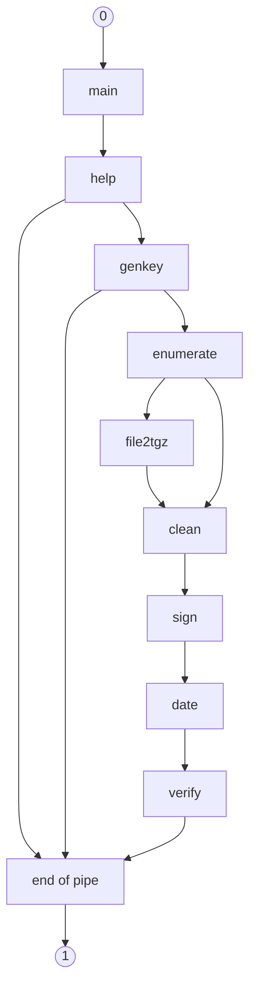
```bash
################################################
# MAIN                                         #
# <$* : help genkey { clean date sign verify } #
# <stdin  : input.raw                          #
# >stdout : output.raw                         #
################################################
main() {
  if (( $# ));then
    help "$*" # suite du pipe
  else
    </dev/null help help # affiche l'aide
  fi | tee >(success "main output: $(lookup)" >&2) | cat
}

:<<'```bash'
```
## <a id=help>help</a>: Aide en ligne
Next: [genkey](#genkey) Previous: [main](#main)
```bash
##################
# Aide en ligne  #
# >stderr : help #
##################
help() {
  strip help "$@" > args
  local rargs=$? args="$(cat args)"
  if ((rargs == 0)) ; then
    # pas d'entrée ni de pipe suivant
    exec </dev/null
    end_of_pipe "$args" >/dev/null

    cat <<EOF >&2
$(echo -e "\033[1;36m")SealGood - $(_ "Document signing and timestamping via") OpenSSL + TSA$(echo -e "\033[0m")

$(_ "Usage"): $myname help genkey { clean date sign verify }

$(_ "COMMANDS"):
  genkey    $(_ "Generate a new password-protected ed25519 key pair")
  help      $(_ "Show this help")
  clean     $(_ "Extract original content without SEALGOOD tags")
  date      $(_ "Timestamp a document via trusted third party (TSA)")
  sign      $(_ "Sign a document with your private key")
  verify    $(_ "Verify document signature and timestamp")

  $(_ "Commands compose into an implicitly ordered pipeline"):

  clean | sign | date | verify
  - $(_ "reads data from") stdin
  - $(_ "comments progress on") stderr
  - $(_ "writes data to") stdout
  - $(_ "does NEVER write/modify any file directly")

  $(_ "Whenever input is a file list, the list is enumerated")
  $(_ "and each item is streamed to the processing pipeline").
  $(_ "The output is packaged in tar+gzip format with cryptographic")
  $(_ "hashes embedded in signed/timestamped filenames")
  enumerate
   \\
     +-- clean | sign | date | verify

  sign date       $(_ "respect existing signature/timestamp");
  enumerate sign  $(_ "asks private key passphrase only once").

$(_ "Examples"):
  $(basename "$0") sign date < contract.pdf > contract_sealgood.pdf
  $(basename "$0") verify    < contract_sealgood.pdf
  ls contract*.pdf | $(basename "$0") sign date > contracts.tgz

$(_ "Files used"):
  \$HOME/.ssh/ed25519_private_*.pem  : $(_ "signer private keys")
  \$HOME/.ssh/ed25519_public_*.pem   : $(_ "associated public keys")
  \$HOME/.ssh/id_rsa.pub             : $(_ "signer identity declaration")
  https://freetsa.org/files/cacert.pem : $(_ "TSA root certificate")

$(_ "Free servlet") :
  ssh -o SendEnv=LANGUAGE sealgood@perso.tlp.name {clean date verify}

$(_ "See also") : https://github.com/tibolpol/sealgood

Copyright (c) 2025 Thibault Le Paul (@tibolpol)
Licence MIT - https://opensource.org/license/mit/
EOF
  else
    genkey "$args" # fonction suivante
  fi
}
:<<'```bash'
```
## <a id=genkey>genkey</a>: Génération des clés ed25519
Next: [enumerate](#enumerate) Previous: [help](#help)
```bash
####################################
# Génération des clés ed25519      #
# <stdin                           #
# <$* : fonctions à exécuter       #
# > $HOME/.ssh/ed25519_private.pem #
# > $HOME/.ssh/ed25519_public.pem  #
####################################
genkey() {
  strip genkey "$@" > args
  local rargs=$? args="$(cat args)"
  if ((rargs == 0));then
    get_profile

    # pas d'entrée ni de pipe suivant
    exec </dev/null
    end_of_pipe "$args" >/dev/null

    [ -s "$PRIVATE_KEY" ] && die 4 "$(_ "%s already exists and has non-zero size" "$PRIVATE_KEY")"

    read -p "$(_ "This key will be used to sign documents, please enter signer name"): " SIGNATAIRE

    PRIVATE_KEY="$HOME"/.ssh/ed25519_private_${SIGNATAIRE// /_}.pem
    PUBLIC_KEY="$HOME"/.ssh/ed25519_public_${SIGNATAIRE// /_}.pem

    [ -s $PRIVATE_KEY ] && die 4 "$(_ "%s already exists and has non-zero size" "$PRIVATE_KEY")"

    # 1. Générer la clé privée chiffrée avec AES-256
    # 2. Extraire la clé publique
    openssl genpkey -algorithm ed25519 -aes-256-cbc -out "$PRIVATE_KEY"
    openssl pkey -in "$PRIVATE_KEY" -pubout -out "$PUBLIC_KEY"

    fmt <<END
$(_ "You can (should) publish %s on a trusted public repository and mention its URL in %s" "$PUBLIC_KEY" "$HOME/.ssh/ed25519_public_${SIGNATAIRE// /_}.url")
$(_ "This way your document signatures will be non-repudiable and therefore accepted").
END
  else
    umask go=      # fichiers temporaires privés
    enumerate "$args" # suite du pipe s'occupe des data
  fi
}

:<<'```bash'
```
## <a id=enumerate>enumerate</a>: Multi-container
Next: [clean](#clean) ou [file2tgz](#file2tgz) Previous: [genkey](#genkey)
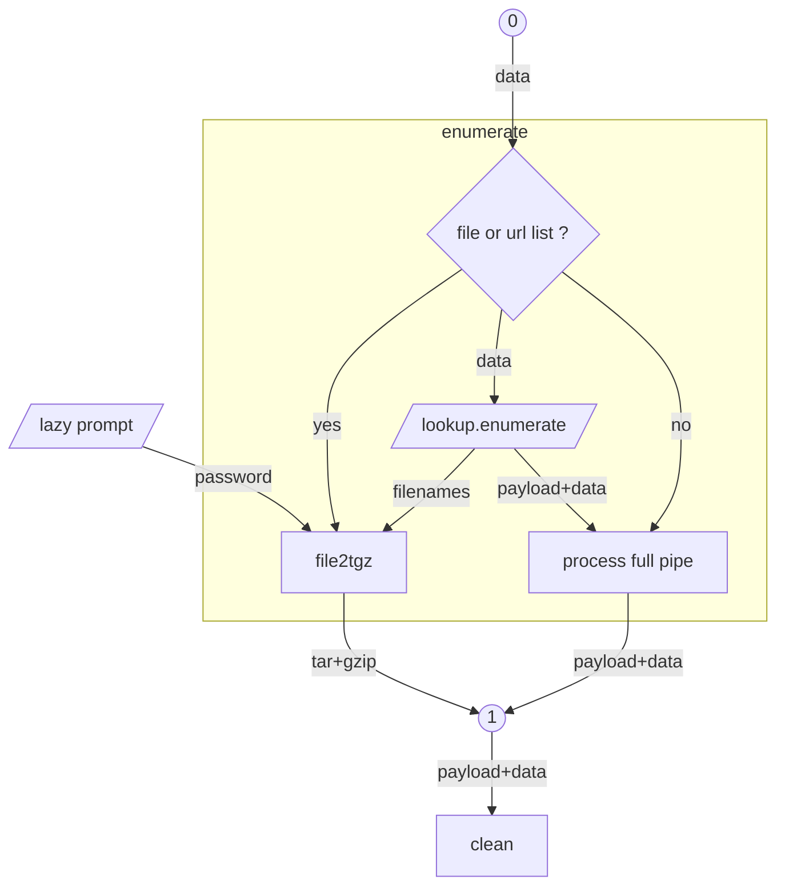
```bash
##############################
# Multi-container            #
# <stdin                     #
# <$* : fonctions à exécuter #
# >stdout : output.raw       #
##############################
enumerate() {
  local args="$*"
  local filetype="$(lookup enumerate)"
  if [[ $filetype =~ file_or_url_list ]];then
    #####################
    # PASS just-in-time #
    #####################
    if strip sign "$args" >/dev/null;then
      coproc passrelay {
        read -r # attend le ask sur &"$fdpassask"
        cat >/dev/null & # puis vide
        if [ "$REPLY" = ask ] ; then
          read -r -s -p "$(_ "Private key password"): " PASS <&"$fdtty"
          echo >&2
          while :; do echo "$PASS"; done
        fi
      }
      exec {fdpassin}<&"${passrelay[0]}" {fdpassask}>&"${passrelay[1]}"
      # signale le coproc à verify
      export fdpassin fdpassask
    fi
    file2tgz "$args"
    rm -f tsr.bin signature.bin # pas de prompt exit_policy
  else
    clean "$args"
  fi < lookup.enumerate
}

:<<'```bash'
```
## <a id=file2tgz>file2tgz</a>: Sélection de fichiers à traiter en batch
Next: [clean](#clean) Previous: [enumerate](#enumerate)
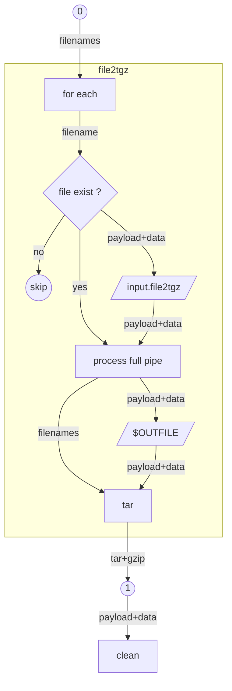
```bash
############################################
# Sélection de fichiers à traiter en batch #
# <stdin : liste de fichiers               #
# >stdout : .tgz du résultat du pipeline   #
############################################
file2tgz(){
  local args="$*"
  mkdir {tar,d1} && (
    cd tar && # working dir tar
    tar --remove-files -zcf - -T <(
      export fdverifyout
      cd ../d1 && # working dir sealgood
      while read -r FILE; do
        export OUTFILE="$(basename "$FILE")"
        ((FNR++))
        export FNR
        if (cd "$INITIAL_DIR" && cat "$STOPFILE$FILE") >"$OUTFILE" 2>/dev/null ;then
          local filetype="$(lookup < "$OUTFILE")"
          <"$OUTFILE" clean "$args" >../tar/"$OUTFILE"
          rm -f lookup.tar* >&2
          local newfiletype="$(lookup tar <../tar/"$OUTFILE")"
          # Nommage en sortie, pattern _sealgood:<sha256sum:8>
          if [[ $newfiletype =~ sealgood ]];then
            hash=$(<lookup.tar.original sha256sum | cut -c1-8)
            base="$(echo "${OUTFILE%.*}" | sed -E 's/_sealgood(:[a-zA-Z0-9]+)?$//')"
            if [[ "$base" == "$OUTFILE" ]]; then
              NEWFILE="${base}_sealgood:${hash}"
            else
              NEWFILE="${base}_sealgood:${hash}.${OUTFILE##*.}"
            fi
            mv -n ../tar/{"$OUTFILE","$NEWFILE"}
            OUTFILE="$NEWFILE"
            # Vérification de l'ancien nom
            if [[ "$FILE" =~ _sealgood:[a-zA-Z0-9]+(\..*)?$ ]] && [[ ! "$FILE" =~ _sealgood:$hash(\..*)?$ ]]; then
              alert="$( _ "Hash in old filename %s doesn't match document hash" "$(basename "$FILE")")"
              alert "$alert"
              alert "$FNR: $alert" 2>&"$fdverifyout"
            fi
          fi
          # décision d'ajouter le fichier en sortie
          if { [        -s ../tar/"$OUTFILE"            ] &&  # le fichier n'est pas vide
              { [[ $filetype != $newfiletype ]] ||  # le status sealgood change
                [[ $newfiletype =~ sealgood  ]];};}  # le nouveau status est ou reste sealgood
          then
            step "enumerate $FILE -> $OUTFILE"
            echo "$OUTFILE" # pris en charge par --remove-files
          else
            rm -f ../tar/"$OUTFILE"
          fi
          unset consecutive_errors
        else
          alert "stdin:$FNR: $(_ "File is not readable: \"%s\"" ${FILE:0:50} )"
          (( ++consecutive_errors >= 5 )) && die 8 "$LINENO: $(_ "Too many consecutive errors: %d" $consecutive_errors)"
        fi
      done
  )) {fdverifyout}> >(
    # Résumé des messages de vérification à la fin
    cat > fdverifyout
    [ -s fdverifyout ] &&
      step "$(_ "Verification summary")"
      cat fdverifyout >&2
      step "$(_ "End of verifications")"
  ) | cat
}

:<<'```bash'
```
## <a id=clean>clean</a>: Restitue input.raw sans payload
Next: [sign](#sign) Previous: [main](#main), [enumerate](#enumerate), [file2tgz](#file2tgz)
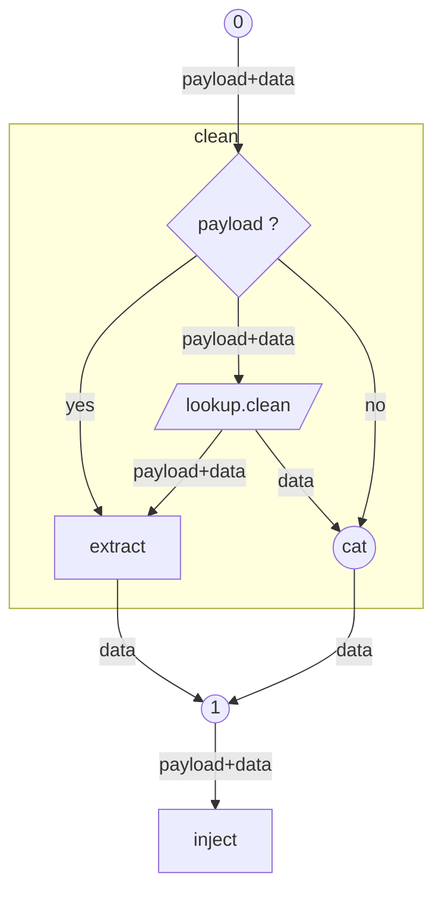
```bash
######################################
# Restitue input.raw sans payload    #
# <stdin                             #
# <$* : fonctions à exécuter         #
# >stdout : original                 #
# <stdin après exécution : payload   #
######################################
clean() {
  strip clean "$@" > args
  local rargs=$? args="$(cat args)"
  if ((rargs == 0));then
    rm -rf lookup.clean{,.payload,.original,.unzip}
    local filetype="$(lookup clean)"
    cat lookup.clean.original
  else
    cat
  fi | sign "$args"
}

:<<'```bash'
```
## <a id=inject>inject</a>: Injection d'informations cachées dans une copie du fichier
Next: [sign](#sign) Previous: [clean](#clean)
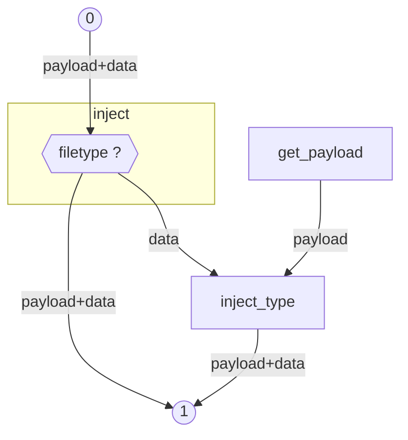
```bash
##############################################################
# Injection d'informations cachées dans une copie du fichier #
# <stdin                                                     #
# <$*     : fonctions à exécuter                             #
# >stdout : copie avec payload & PLACEHOLDER                 #
##############################################################
inject() {
  strip inject "$@" > args
  local rargs=$? args="$(cat args)"
  if ((rargs == 0));then
    local filetype="$(lookup inject)"
    if ! [[ $filetype =~ sealgood ]]; then
      rm -f lookup.inject.payload
      get_payload < lookup.inject.unzip > lookup.inject.payload
      chmod -w lookup.inject.payload
    fi
    inject_type "$filetype" | tee >(echo "inject output: $(lookup)" >&2)
    rm -f lookup.inject{,.unzip,.payload,.original}
  else
    cat
  fi | sign "$args"
}

:<<'```bash'
```
## <a id=date>date</a>: Horodatage d'un document (payload, hash, signature)
Next: [verify](#verify) Previous: [sign](#sign)
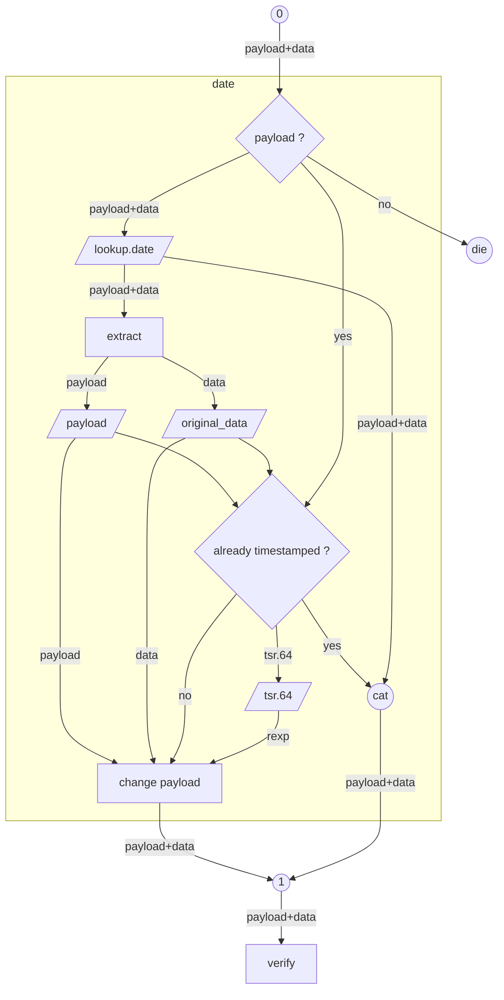
```bash
#######################################################
# Horodatage d'un document (payload, hash, signature) #
# <stdin                                              #
# <$* : fonctions à exécuter                          #
# >stdout : copie horodatée avec payload              #
#######################################################
date() {
  strip date "$@" > args
  local rargs=$? args="$(cat args)"
  if ((rargs == 0));then
    local filetype="$(lookup date)"
    if ! [[ $filetype =~ sealgood ]];then
      filetype="$(
        mv lookup.date tmp
        rm -f lookup.date{,.unzip,.payload,.original}
        <tmp inject inject | lookup date
        rm -f tmp
      )"
    fi <lookup.date
    if [[ $filetype =~ sealgood ]];then
      <lookup.date.payload awk '/\/sig\.64$/,/\/sig\.bin$/' | grep -vE '/sig\.64$|/sig\.bin$|^PLACEHOLDER' | tr -d ' \n'                  | base64 -d >sig.tmp
      <lookup.date.payload awk '/\/tsr\.64$/,/\/tsr\.bin$/' | grep -vE '/tsr\.64$|/tsr\.bin$|^PLACEHOLDER' | tr -d ' \n' | tee tsr.tmp.64 | base64 -d >tsr.tmp
      # parse payload existing sign + existing tsr
      if <lookup.date.payload grep -aq "^PLACEHOLDER_UNTIMESTAMPED_FILE" ||
        ! openssl ts -verify -in tsr.tmp -CAfile <(<lookup.date.payload tsa_cert) -data sig.tmp &> ts_result; then
          if [ -s sig.tmp ]; then
            cat sig.tmp # Horodatage sur la signature (préférable ? obligatoire ?)
            ts_verify="openssl ts -verify -in /tmp/tsr.bin -CAfile /tmp/freetsa_cacert.pem -data /tmp/sig.bin # $(_ "verify timestamp")"
          else
            cat lookup.date.original # Horodatage sur le document clean (ancienne méthode)
            ts_verify="openssl ts -verify -in /tmp/tsr.bin -CAfile /tmp/freetsa_cacert.pem -data /tmp/\$filename.pdf # $(_ "verify timestamp")"
          fi | timestamp | base64 -w 0 | tr -d ' \n' >tsr.64
      fi
      if [ -s tsr.64 ];then
        local REXP="^PLACEHOLDER_UNTIMESTAMPED_FILE"
        grep -aq "$REXP" <lookup.date.payload || {
          REXP="$(cat  tsr.tmp.64)"
          grep -aq "$REXP" <lookup.date.payload ||
            die 8 "$LINENO: assert failure"
        }
        REXP="s|$REXP|$(cat tsr.64)|"
        ts_verify="s|^openssl ts -verify -in.*|$ts_verify|"
        # edit du résultat
        if [[ $filetype =~ gzip ]];then
          cat lookup.date.original
          <lookup.date.payload sed -e "$REXP" | gzip -n
        else
          <lookup.date         sed -e "$REXP" # DANGER : lit tout le doc
        fi
      else
        cat lookup.date
        warning "$(_ "Already timestamped")"
      fi </dev/null  # protege stdin
    else
      cat lookup.date
    fi | tee >(echo "date output: $(lookup)" >&2)
    rm -f lookup.date{,.unzip,.payload,.original}
  else
    cat
  fi | verify "$args"
}

:<<'```bash'
```
## <a id=sign>sign</a>: Signature d'un document (payload, hash, signature)
Next: [date](#date) Previous: [clean](#inject)
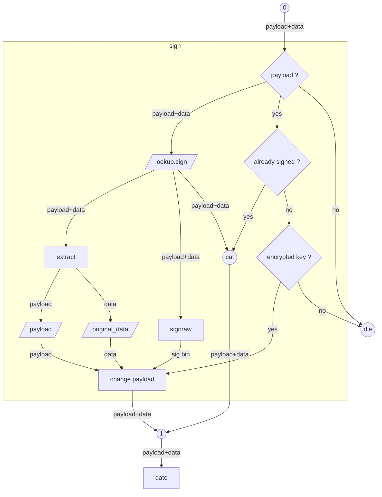
```bash
######################################################
# Signature d'un document (payload, hash, signature) #
# stdin   : data à signer                            #
# <$*     : fonctions à exécuter                     #
# <$PRIVATE_KEY : nom local de la clé privée         #
# >stdout : copie signée avec payload                #
######################################################
sign() {
  strip sign "$@" > args
  local rargs=$? args="$(cat args)"
  if ((rargs == 0));then
    local filetype="$(lookup sign)"
    if ! [[ $filetype =~ sealgood ]];then
      filetype="$(
        mv lookup.sign tmp
        rm -f lookup.sign{,.unzip,.payload,.original}
        <tmp inject inject | lookup sign
        rm -f tmp
      )"
    fi <lookup.sign
    if [[ $filetype =~ sealgood ]];then
      get_profile
      if grep -aq "^PLACEHOLDER_UNSIGNED_FILE" lookup.sign.payload; then
        grep -q 'empty password' <( openssl pkey -in "$PRIVATE_KEY" -noout -passin pass: </dev/null 2>&1) | cat || die 4 "$(_ "%s is not encrypted" "$PRIVATE_KEY")"
        if [[ $filetype =~ gzip ]];then
          cat lookup.sign.original
          <lookup.sign.payload sed "s|^PLACEHOLDER_UNSIGNED_FILE|$(<lookup.sign signraw | base64 -w 0)|" | gzip -nc
        else
          <lookup.sign         sed "s|^PLACEHOLDER_UNSIGNED_FILE|$(<lookup.sign signraw | base64 -w 0)|"
        fi
      else
        cat lookup.sign
        warning "$(_ "Already signed")"
      fi </dev/null
    else
      cat lookup.sign
    fi | tee >(echo "sign output: $(lookup)" >&2)
    rm -f lookup.sign{,.unzip,.payload,.original}
  else
    cat
  fi | date "$args"
}

:<<'```bash'
```
## <a id=verify>verify</a>: Vérification de sealgood signature & timestamp
Next: [end_of_pipe](#end_of_pipe) Previous: [date](#date)
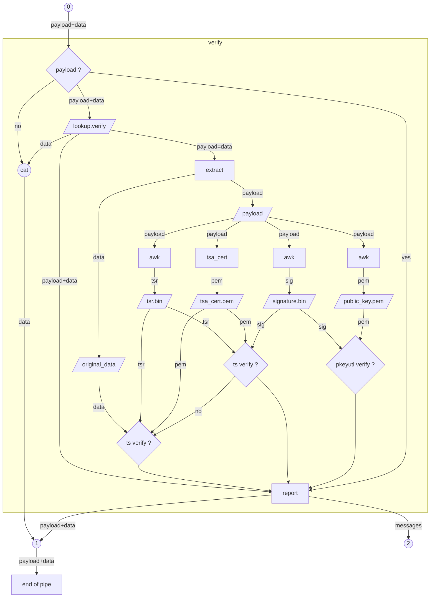
```bash
##################################################
# Vérification de sealgood signature & timestamp #
# <stdin  : data avec payload                    #
# <$*     : fonctions à exécuter                 #
# >stderr : statut de la vérification            #
# >stdout : copie de data                        #
##################################################
verify() {
  strip verify "$@" > args
  local rargs=$? args="$(cat args)"
  if ((rargs == 0));then
    rm -f lookup.verify{,.unzip,.payload,.original}
    local filetype="$(lookup verify)"
    rm -f tsr.bin signature.bin
    if [[ $filetype =~ sealgood ]];then
      # Extraction des éléments du document
      step "$(_ "Extracting verification elements")"

      # 1. Extraction du contenu original
      [ -s lookup.verify.original ] &&
      success "$(_ "Original content extracted")"

      # 2. Extraction de la signature
      <lookup.verify.payload awk '/\/sig\.64$/,/\/sig\.bin$/' | grep -vE '/sig\.64$|/sig\.bin$|^PLACEHOLDER' | tr -d ' \n' | base64 -d >signature.bin
      if ! [ -s signature.bin ]; then
        warning "$(_ "Signature not found in document")"
      else
        success "$(_ "Signature extracted and decoded")"
        # 3. Extraction de la clé publique
        <lookup.verify.payload awk '/-----BEGIN PUBLIC KEY-----/,/-----END PUBLIC KEY-----/' | head -n 3 >public_key.pem
        if ! [ -s public_key.pem ]; then
          warning "$(_ "Public key not found in document")"
        else
          success "$(_ "Public key extracted")"
        fi
      fi

      # 4. Extraction du TSR
      <lookup.verify.payload awk '/\/tsr\.64$/,/\/tsr\.bin$/' | grep -vE '/tsr\.64$|/tsr\.bin$|^PLACEHOLDER' | tr -d ' \n' | base64 -d >tsr.bin
      if ! [ -s tsr.bin ]; then
        warning "$(_ "TSR not found in document")"
      else
        success "$(_ "TSR extracted and decoded")"

        # 5. Extraction du certificat TSA
        tsa_cert <lookup.verify.payload
        [ -s tsa_cert.pem ] && success "$(_ "TSA certificate extracted")"
      fi

      if [ -s tsa_cert.pem ] || [ -s public_key.pem ]; then

        # Vérification de la signature
        if [ -s public_key.pem ] && [ -s signature.bin ] && [ -s lookup.verify.original ]; then
          step "$(_ "Verifying digital signature")"
          (
            # <lookup.verify.payload grep -qa \
            # -e 'openssl pkeyutl -verify -pubin -inkey /tmp/.* -sigfile /tmp/sig.bin -rawin -in /tmp/file.pdf' &&
            set -x
            openssl pkeyutl -verify -pubin -inkey public_key.pem -sigfile signature.bin -rawin -in lookup.verify.original &> sig_result
          ) || (
            set -x
            openssl pkeyutl -verify -pubin -inkey public_key.pem -sigfile signature.bin -in <(openssl dgst -sha256 -binary lookup.verify.original) &> sig_result
          )
          SIG_VERIFY=$?

          if (( SIG_VERIFY  == 0 )); then
            success "$(_ "Signature successfully verified")"
            SIGNATURE_VALID=true
          else
            alert "$(_ "Signature verification failed")"
            cat sig_result >&2
            SIGNATURE_VALID=false
          fi
        fi

        # Vérification de l'horodatage
        if [ -s tsr.bin ] && [ -s tsa_cert.pem ] && [ -s lookup.verify.original ] ; then
          step "$(_ "Verifying TSA timestamp")"
          (( DATE_VERIFY = 1 ))
          if [ -s signature.bin ];then
            (
              # <lookup.verify.payload grep -qa \
              # -e 'openssl ts -verify -in /tmp/tsr.bin -CAfile /tmp/freetsa_cacert.pem -data /tmp/sig' &&
              set -x
              openssl ts -verify -in tsr.bin -CAfile tsa_cert.pem -data signature.bin &> ts_result
            )
            DATE_VERIFY=$?
          fi
          if (( DATE_VERIFY != 0 ));then
            (
              set -x
              openssl ts -verify -in tsr.bin -CAfile tsa_cert.pem -data lookup.verify.original &> ts_result
            )
            DATE_VERIFY=$?
          fi
          if (( DATE_VERIFY == 0 )); then
            success "$(_ "Timestamp successfully verified")"
            TIMESTAMP_VALID=true
          else
            alert "$(_ "Timestamp verification failed")"
            cat ts_result >&2
            TIMESTAMP_VALID=false
          fi

          # Affichage des détails de l'horodatage
          echo -e "\n$(_ "Timestamp details"):" >&2
          openssl ts -reply -in tsr.bin -text | grep -A2 "Time stamp:" >&2
        fi
      fi

      # Résumé final
      step "$(_ "Verification summary")"

      echo -e "$(_ "Signature status"): $([ "$SIGNATURE_VALID" = true ] && success "$(_ "VALID")" 2>&1 || { [ "$SIGNATURE_VALID" = false ] && alert "$(_ "INVALID")" || warning "$(_ "MISSING")" 2>&1 ; } 2>&1)" >&2
      echo -e "$(_ "Timestamp status"): $([ "$TIMESTAMP_VALID" = true ] && success "$(_ "VALID")" 2>&1 || { [ "$TIMESTAMP_VALID" = false ] && alert "$(_ "INVALID")" || warning "$(_ "MISSING")" 2>&1 ; } 2>&1)" >&2

      # signé, horodaté et intact
      # signé et intact
      # horodaté et intact
      # ni signé ni horodaté
      # altéré
      if   [ "$SIGNATURE_VALID" = true ] && [ "$TIMESTAMP_VALID" = true ]; then
        success "$(_ "Document") $(_ "is signed, timestamped and intact")"
        ((fdverifyout)) && success "$FNR: $OUTFILE $(_ "is signed, timestamped and intact")" 2>&$fdverifyout
      elif [ "$SIGNATURE_VALID" = true ] && [ "$TIMESTAMP_VALID" = "" ]; then
        success "$(_ "Document") $(_ "is signed and intact")"
        ((fdverifyout)) && success "$FNR: $OUTFILE $(_ "is signed and intact")" 2>&$fdverifyout
      elif [ "$SIGNATURE_VALID" = ""   ] && [ "$TIMESTAMP_VALID" = true ]; then
        success "$(_ "Document") $(_ "is timestamped and intact")"
        ((fdverifyout)) && success "$FNR: $OUTFILE $(_ "is timestamped and intact")" 2>&$fdverifyout
      elif [ "$SIGNATURE_VALID" = ""   ] && [ "$TIMESTAMP_VALID" = "" ]; then
        warning "$(_ "Document") $(_ "is neither signed nor timestamped")"
        ((fdverifyout)) && success "$FNR: $OUTFILE $(_ "is neither signed nor timestamped")" 2>&$fdverifyout
      else
        alert "$(_ "Document") $(_ "has been altered")"
        ((fdverifyout)) && alert "$FNR: $OUTFILE $(_ "has been altered")" 2>&$fdverifyout
      fi
      cat lookup.verify
    else
      cat lookup.verify
    fi | tee >(echo "verify output: $(lookup)" >&2) | cat
  else
    cat
  fi | end_of_pipe "$args"
}

:<<'```bash'
```
## <a id=end_of_pipe>end_of_pipe</a>: Arguments restants en bout de pipe
```bash
######################################
# Arguments restants en bout de pipe #
######################################
end_of_pipe(){
  (( $# && $(eval echo -n "$*" | wc -c) )) &&
    warning "$(_ "Remaining arguments \"%s\" could not be processed" "$*")"
  cat
}

:<<'```bash'
```
## <a id=strip>strip</a>: Consommation de la chaîne d'arguments
```bash
#########################################
# Consommation de la chaîne d'arguments #
# <$1   : mot                           #
# <$*:2 : autres                        #
# >stdout : autres sans mot             #
# >$?   : présence mot                  #
#########################################
strip() {
  local word="$1"
  local input="${*:2}"  # Get all arguments after the first one
  if [[ "$input" =~ (^|[[:space:]])"$word"($|[[:space:]]) ]]; then
    echo -n "${input//$word/}"
    return 0
  else
    echo -n "$input"
    return 1
  fi
}

:<<'```bash'
```
## <a id=get_payload>get_payload</a>: PAYLOAD : Incorpore les explications et les signatures
```bash
#######################################################################
# PAYLOAD : Incorpore les explications et les signatures              #
# C'est juste du plaintext qui commence et termine par des balises    #
# <stdin : original data                                              #
# <$REPOS_KEY : nom web de la clé publique                            #
# <$PUBLIC_KEY : nom local de la clé publique                         #
# <$HOME/.ssh/id_rsa.pub : emplacement du nom du signataire           #
# <https://freetsa.org/files/cacert.pem : cartificat racine de la TSA #
# >stdout : payload                                                   #
#######################################################################
get_payload() {
[ -s original_data ] || cat > original_data
get_profile
cat <<EOD
### BEGIN SEALGOOD SIGNATURE ###
SealGood - $(_ "The 100%% DIY Document Authenticator")
Copyright (c) 2025 Thibault Le Paul (@tibolpol)
Licence MIT - https://opensource.org/license/mit/
https://github.com/tibolpol/sealgood/

$(_ "WARNING!  As with a physical document, verifying authenticity and signature is
harder than signing.  The key is to guarantee that the means exist, that they
are freely and publicly available, and that they use recognized, documented
and standard tools at each step for transparency of proof.  Each step can
therefore be done manually with this guide.  A lightweight integration is
proposed on the site"):  https://github.com/tibolpol/sealgood

$(_ "Verification tools"):
- $(_ "POSIX standard"): awk, base64, file, wc
- $(_ "non-POSIX but recognized standard"): openssl

$(_ "Free servlet"):
ssh -o SendEnv=LANGUAGE sealgood@perso.tlp.name {clean date verify} < "\$filename.pdf" > /tmp/result

$(_ "The signed document has the following properties"):
file -bi : $(<original_data lookup)
wc       : $(<original_data wc -)

$(_ "Signer declaration"): $(cut -d' ' -f3- < $HOME/.ssh/id_rsa.pub)
$(_ "Signer ed25519 public key"): $REPOS_KEY

$(_ "WARNING!  The readable signer declaration here could have been forged.  What
makes it valid is the trusted third party associated with this key (website,
personal exchange, blockchain, public key sealed and published on an
irrefutable address by the signer)").

$(_ "The signature and timestamp remain valid as long as the content outside the
BEGIN SEALGOOD and END SEALGOOD tags is not altered").

$(_ "If verification element 4 is not a PLACEHOLDER but a base64 signature code,
the signer's identity can be proven").

## $(_ "Verification element") 1:  $(_ "Key presentation URL, presented by the
# signer as trusted, so that they cannot repudiate this signature").
# $REPOS_KEY

## $(_ "Verification element") 2:  $(_ "Signer's ed25519 public key")
# $(_ "COPY the three lines below and PASTE into file /tmp/%s") "$(basename "$PUBLIC_KEY")"
# $(_ "or download %s to /tmp/%s") "$REPOS_KEY" "$(basename "$PUBLIC_KEY")"
-----BEGIN PUBLIC KEY-----
$(awk '/^-----BEGIN PUBLIC KEY/{getline;print;exit}' "$PUBLIC_KEY")
-----END PUBLIC KEY-----

## $(_ "Verification element") 3:  $(_ "Unsigned file without payload") ($(_ "just before signing"))
awk '/^### BEGIN SEALGOOD /{state=1}!state{print}/^### END SEALGOOD /{state=0}' < "\$filename.pdf" > /tmp/\$filename.pdf # $(_ "Unsigned file without payload")

## $(_ "Verification element") 4:  $(_ "Signature of the original file hash")
# $(_ "COPY the line below and PASTE into file") /tmp/sig.64
PLACEHOLDER_UNSIGNED_FILE
base64 -d < /tmp/sig.64 > /tmp/sig.bin

## $(_ "Final verification"):  $(_ "Current file hash and validation of match using public key")
# $(_ "Links the file hash to the private key owner's trust chain")
openssl dgst -sha256 -binary /tmp/file.pdf >/tmp/hash.bin
openssl pkeyutl -verify -pubin -inkey /tmp/\$(basename "\$PUBLIC_KEY") -sigfile /tmp/sig.bin -in /tmp/hash.bin # $(_ "verify signature")

### BEGIN SEALGOOD TIMESTAMP ###

$(_ "If verification element 2 is not a PLACEHOLDER but a base64 code, the signing
date can be proven").

## $(_ "Verification element") 1:  $(_ "TSA authority root certificate")
# $(_ "COPY the three lines below and PASTE into file") /tmp/freetsa_cacert.pem
# $(_ "or download %s to %s" https://freetsa.org/files/cacert.pem /tmp/freetsa_cacert.pem)
$(
  [ -s freetsa_cacert.pem ] ||
  curl -s https://freetsa.org/files/cacert.pem |
  awk '$1~"^-----"{if(buf){print buf;buf=""};print;next}{buf=buf $0}END{printf("%s",buf)}' >tsa_cert.pem
  cat tsa_cert.pem
)
openssl x509 -reply -text -in /tmp/freetsa_cacert.pem # $(_ "show certificate details")

## $(_ "Verification element") 2:  $(_ "Base64 encoding of TSA-validated tsr")
# $(_ "COPY the line below and PASTE into file") /tmp/tsr.64
PLACEHOLDER_UNTIMESTAMPED_FILE
base64 -d < /tmp/tsr.64 > /tmp/tsr.bin
openssl ts -reply -text -in /tmp/tsr.bin # $(_ "show timestamp details")

## $(_ "Verification element") 3:  $(_ "Untimestamped file without payload") ($(_ "just before timestamping"))
awk '/^### BEGIN SEALGOOD /{state=1}!state{print}/^### END SEALGOOD /{state=0}' < "\$filename.pdf" > /tmp/\$filename.pdf # $(_ "Unsigned file without payload")

## $(_ "Final verification"):  $(_ "Either current file or your signature hash, and validation of match
# using tsr and certificate chain")
# $(_ "Links your signature or file hash to the tsr date in the TSA trust chain")
openssl ts -verify -in /tmp/tsr.bin -CAfile /tmp/freetsa_cacert.pem -data /tmp/sig.bin # $(_ "verify timestamp")
openssl ts -verify -in /tmp/tsr.bin -CAfile /tmp/freetsa_cacert.pem -data /tmp/\$filename.pdf # $(_ "verify timestamp")

### END SEALGOOD ###
EOD
}

:<<'```bash'
```
## <a id=tsa_cert>tsa_cert</a>: Extraction du certificat TSA
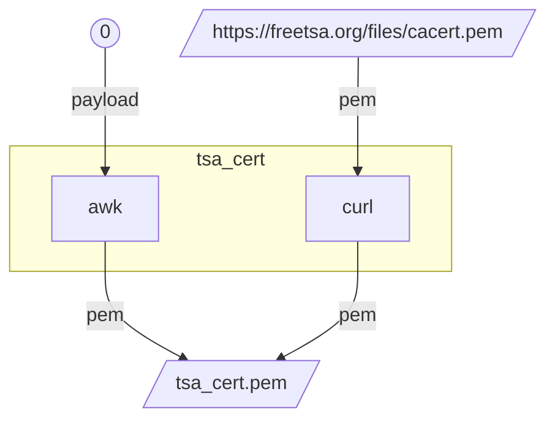
```bash
################################
# Extraction du certificat TSA #
# <stdin : payload             #
# >tsa_cert.pem                #
################################
tsa_cert() {
  if ! [ -s tsa_cert.pem ];then
    awk '/-----BEGIN CERTIFICATE-----/,/-----END CERTIFICATE-----/' >tsa_cert.pem
    if ! [ -s tsa_cert.pem ]; then
      warning "$(_ "TSA certificate not found - Downloading from") freetsa.org"
      curl -s https://freetsa.org/files/cacert.pem >tsa_cert.pem ||
      warning "$(_ "Failed to download TSA certificate")"
    fi
  fi
}

:<<'```bash'
```
## <a id=timestamp>timestamp</a>: Calcule un timestamp
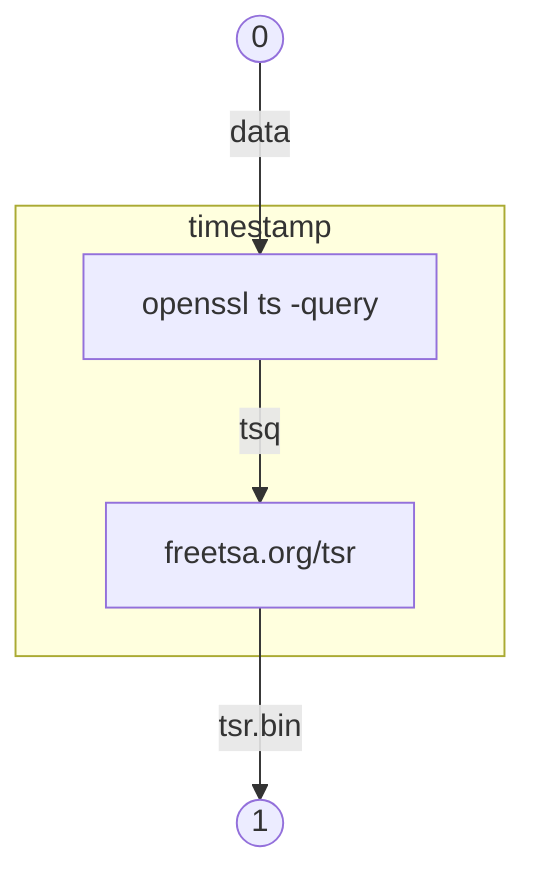
```bash
########################
# Calcule un timestamp #
# <stdin  : data       #
# >stdout : tsr.bin    #
########################
timestamp() {
  openssl ts -query -data /dev/stdin -sha256 -cert |
  curl -s -H "Content-Type: application/timestamp-query" --data-binary @- --output - https://freetsa.org/tsr
}

:<<'```bash'
```
## <a id=signraw>signraw</a>: Calcule une signature
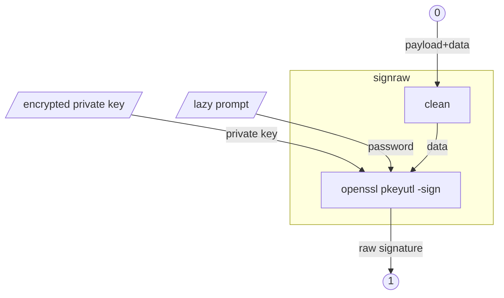
```bash
###########################
# Calcule une signature   #
# <stdin                  #
# >stdout : signature.bin #
###########################
signraw() {
  clean clean >original_data
  if ((fdpassin)); then
    echo ask >&"$fdpassask"
    openssl pkeyutl -sign -inkey "$PRIVATE_KEY" -rawin -in original_data -passin stdin <&"$fdpassin"
  else
    openssl pkeyutl -sign -inkey "$PRIVATE_KEY" -rawin -in original_data
  fi
}

:<<'```bash'
```
## <a id=signdgst>signdgst</a>: Calcule une signature
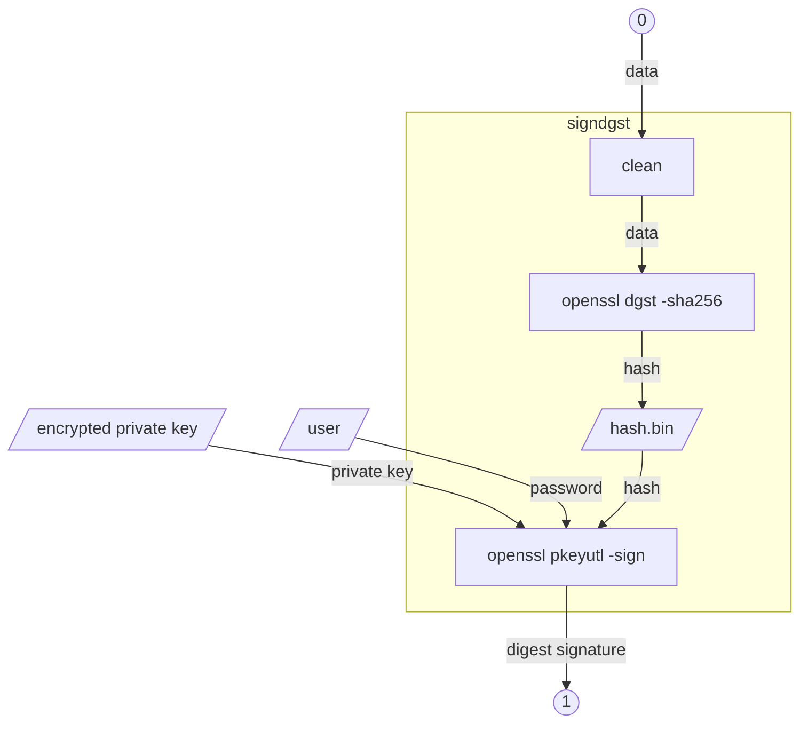
```bash
###########################
# Calcule une signature   #
# <stdin                  #
# >stdout : signature.bin #
###########################
signdgst(){
  # Cette signature n'est pas compatible avec le schéma de clé
  clean clean | openssl dgst -sha256 -binary >hash.bin
  if ((fdpassin)); then
    echo ask >&"$fdpassask"
    openssl pkeyutl -sign -inkey "$PRIVATE_KEY" -in hash.bin -passin stdin <&"$fdpassin"
  else
    openssl pkeyutl -sign -inkey "$PRIVATE_KEY" -in hash.bin
  fi
}

:<<'```bash'
```
## <a id=exit_policy>exit_policy</a>: Sortie de script
```bash
###############################################################
# Sortie de script                                            #
# Prompt pour conserver le répertoire temporaire après verify #
# Désactivé par enumerate en supprimant les fichiers          #
###############################################################
exit_policy(){
  [ -s tsr.bin ] || [ -s signature.bin ] &&
  <&"$fdtty" read -r -p $'\n\033[1;36m'"=== $(_ "Keep temporary directory for inspection") [yN] ? "$'\033[0m' &&
  [[ $REPLY == y ]] &&
  warning "$PWD $(_ "is kept")" &&
  ls -l >&2 ||
  rm -rf "$TMPDIR"
}

:<<'```bash'
```
## <a id=die>die</a> <a id=alert>alert</a> <a id=step>step</a> <a id=success>success</a> <a id=warning>warning</a>: Envoi de messages
```bash
#####################
# Envoi de messages #
#####################
die() {
  rc="$1"
  shift
  alert "$(basename "$0") rc=$rc $*"
  exit "$rc"
}
alert() {
  echo -e "\033[1;31m$(_ "ERROR"): $*\033[0m" >&2
}
step() {
  echo -e "\n\033[1;36m=== $* ===\033[0m" >&2
}
success() {
  echo -e "\033[1;32m$*\033[0m" >&2
}
warning() {
  echo -e "\033[1;33m$*\033[0m" >&2
}

:<<'```bash'
```
## <a id=get_profile>get_profile</a>: Dépendances user
```bash
get_profile() {
  list=("$HOME"/.ssh/ed25519_private*.pem)
  export PRIVATE_KEY="${list[0]}" # nom local de la clé privée
  list=("$HOME"/.ssh/ed25519_public*.pem)
  export PUBLIC_KEY="${list[0]}" # nom local de la clé publique
  export REPOS_KEY="$(cat < "$HOME"/.ssh/ed25519_public*.url)" # nom web de la clé publique
}

:<<'```bash'
```
## <a id=_>_</a>: I18n
```bash
_(){
  key="$1"
  shift
  printf "$(gettext "$key")" "$@"
}

:<<'```bash'
```
## <a id=run>run</a>: RUN
```bash
################################
# Vérification des dépendances #
################################
for cmd in awk openssl base64 curl; do
  command -v $cmd &> /dev/null ||
  die 16 "$LINENO: $(_ "Missing command"): $cmd"
done </dev/null

export myname="$(basename "$0")"
export TEXTDOMAIN="$myname"
export mydir="$(dirname "$(realpath "$0")")"
. "$mydir"/filetypes # définitions de fonctions plugin
export TEXTDOMAINDIR="${mydir/bin/locale}"
export TMPDIR="$(mktemp -d)"
trap exit_policy EXIT
cd "$TMPDIR" || die 16 "$LINENO: FATAL"
INITIAL_DIR="$OLDPWD"
STOPFILE="${STOPFILE:-}" # simple et efficace pour la servlet
shopt -s nullglob

(( fdtty )) || exec {fdtty}</dev/tty
export fdtty

tcat(){
  cat #tee >( ((fddebug)) && echo "#tcat $* $(file -bi -)" >&$fddebug)
}
export -f tcat

main "$@" | cat
